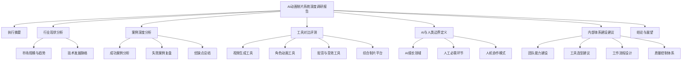

## Product Overview

一份关于 AI 动画制片系统的深度调研报告，通过网络调研收集行业案例、工具对比、技术边界分析等信息，帮助用户全面了解 AI 动画制作领域的现状、能力边界和最佳实践，为内部体系建设提供决策依据。

## Core Features

- 行业案例深度分析：收集并分析网络上的 AI 动画 demo 和实际案例，包含优缺点评估，所有案例附源链接
- 主流工具对比评测：对比分析当前市场上主流的 AI 动画制作工具，包括功能、价格、适用场景等维度
- AI 与人类边界定义：明确 AI 在动画制作流程中的能力边界，定义哪些环节适合 AI 处理、哪些需要人工介入
- 内部体系建设建议：基于调研结果，提供内部 AI 动画制片体系的建设路径和最佳实践建议
- 图文并茂的报告呈现：以 Markdown 格式输出，包含图表、流程图、对比表格等可视化元素

## Tech Stack

- 文档格式：Markdown
- 图表工具：Mermaid（流程图、架构图）
- 输出形式：静态文档报告

## 报告结构设计

### 文档架构



### 报告模块划分

- **执行摘要模块**：核心发现与关键建议的精炼总结
- **行业分析模块**：市场现状、技术趋势、主要玩家分析
- **案例研究模块**：网络案例收集、深度分析、源链接汇总
- **工具评测模块**：主流工具功能对比、价格对比、适用场景分析
- **边界定义模块**：AI 能力边界、人工价值点、协作模式设计
- **建设建议模块**：内部体系搭建路径、资源配置建议

### 数据流程

用户需求输入 --> 网络调研收集 --> 信息整理分类 --> 深度分析提炼 --> 可视化呈现 --> 报告文档输出

## Implementation Details

### 报告目录结构

```
ai-animation-research-report/
├── README.md                    # 报告主文档
├── sections/
│   ├── 01-executive-summary.md  # 执行摘要
│   ├── 02-industry-analysis.md  # 行业现状分析
│   ├── 03-case-studies.md       # 案例深度分析
│   ├── 04-tool-comparison.md    # 工具对比评测
│   ├── 05-boundary-definition.md # AI与人类边界
│   └── 06-recommendations.md    # 内部体系建设建议
├── assets/
│   └── diagrams/                # 图表资源
└── references/
    └── sources.md               # 所有源链接汇总
```

### 关键内容结构

**案例分析模板**：每个案例包含项目名称、制作团队、技术栈、成果展示、优点分析、缺点分析、源链接

**工具对比维度**：工具名称、核心功能、技术特点、价格模式、优势、劣势、适用场景、官方链接

**边界定义框架**：制作环节、AI 能力评级、人工必要性、推荐协作模式、风险提示