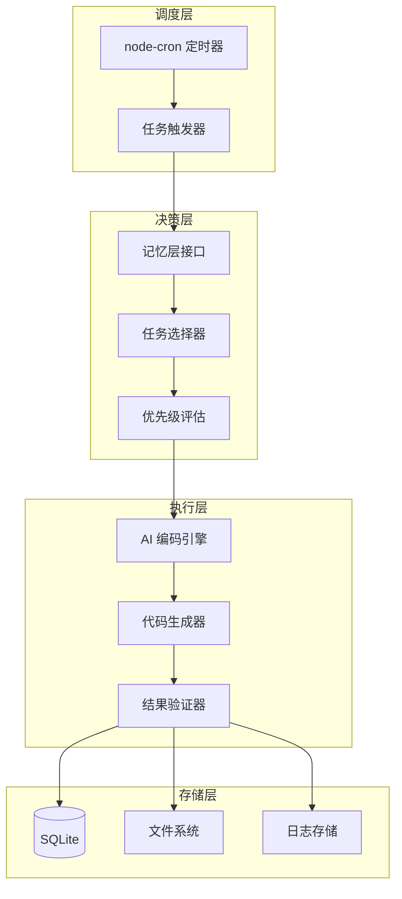

## Product Overview

为 Iris 数字分身添加自动任务执行能力，构建一个后台调度服务与 AI 编码执行器的组合系统。系统每天在固定时间自动启动，根据记忆层内容智能选择待执行的编码任务，调用 AI 能力完成代码编写，并生成标准化的交付物。

## Core Features

- **定时调度服务**：后台持续运行的 Node.js 服务，支持配置每日固定执行时间，自动触发任务流程
- **记忆驱动任务选择**：连接数字分身记忆层，分析待办事项、项目进度、优先级等信息，智能决策当日执行任务
- **AI 编码执行器**：调用 AI 编码能力，根据选定任务自动生成代码，支持多种编程语言和项目类型
- **交付物生成**：任务完成后自动生成交付报告，包含代码文件、执行日志、完成状态等信息
- **执行状态管理**：记录每次执行的任务详情、耗时、结果，支持历史查询和执行统计

## Tech Stack

- 运行时：Node.js 18+ with TypeScript
- 调度框架：node-cron 定时任务调度
- AI 集成：Claude API / OpenAI API
- 数据存储：本地 JSON 文件 + SQLite 轻量数据库
- 日志系统：winston 日志框架
- 进程管理：PM2 守护进程

## Tech Architecture

### System Architecture

采用分层架构设计，包含调度层、决策层、执行层和存储层，各层职责清晰，通过接口解耦。



### Module Division

- **Scheduler Module**：负责定时任务调度，支持 cron 表达式配置，管理任务触发时机
- **Memory Module**：对接数字分身记忆层，读取待办任务、项目信息、历史执行记录
- **Decision Module**：基于记忆内容进行任务筛选和优先级排序，输出当日执行计划
- **Executor Module**：调用 AI API 执行编码任务，管理代码生成流程
- **Delivery Module**：生成交付物，包括代码文件打包、执行报告、状态更新

### Data Flow


## Implementation Details

### Core Directory Structure

```
auto-agent-scheduler/
├── src/
│   ├── scheduler/
│   │   ├── cron.ts           # 定时任务配置
│   │   └── trigger.ts        # 任务触发器
│   ├── memory/
│   │   ├── reader.ts         # 记忆层读取
│   │   └── writer.ts         # 记忆层更新
│   ├── decision/
│   │   ├── selector.ts       # 任务选择器
│   │   └── priority.ts       # 优先级评估
│   ├── executor/
│   │   ├── ai-client.ts      # AI API 客户端
│   │   ├── code-generator.ts # 代码生成器
│   │   └── validator.ts      # 结果验证
│   ├── delivery/
│   │   ├── reporter.ts       # 报告生成
│   │   └── packager.ts       # 交付物打包
│   ├── types/
│   │   └── index.ts          # 类型定义
│   ├── utils/
│   │   ├── logger.ts         # 日志工具
│   │   └── config.ts         # 配置管理
│   └── index.ts              # 入口文件
├── data/
│   ├── memory/               # 记忆层数据
│   ├── deliveries/           # 交付物存储
│   └── scheduler.db          # SQLite 数据库
├── logs/                     # 日志目录
├── config/
│   └── default.json          # 默认配置
├── package.json
├── tsconfig.json
└── ecosystem.config.js       # PM2 配置
```

### Key Code Structures

**Task 接口定义**：定义任务的核心数据结构，包含任务标识、类型、优先级、执行上下文等关键信息。

```typescript
interface Task {
  id: string;
  title: string;
  type: 'coding' | 'review' | 'refactor';
  priority: 'high' | 'medium' | 'low';
  context: TaskContext;
  status: 'pending' | 'running' | 'completed' | 'failed';
  createdAt: Date;
  scheduledAt?: Date;
}

interface TaskContext {
  projectPath: string;
  requirements: string;
  relatedFiles: string[];
  expectedOutput: string;
}
```

**ExecutionResult 接口**：记录任务执行结果，包含生成的代码文件、执行日志、耗时统计等信息。

```typescript
interface ExecutionResult {
  taskId: string;
  success: boolean;
  outputs: CodeOutput[];
  logs: string[];
  duration: number;
  completedAt: Date;
  error?: string;
}

interface CodeOutput {
  filePath: string;
  content: string;
  language: string;
  linesOfCode: number;
}
```

**Scheduler 类**：核心调度器，管理定时任务的注册、触发和执行流程。

```typescript
class Scheduler {
  private cronJob: CronJob;
  private memoryReader: MemoryReader;
  private taskSelector: TaskSelector;
  private executor: CodeExecutor;
  
  async start(): Promise<void> { }
  async stop(): Promise<void> { }
  async executeDaily(): Promise<ExecutionResult[]> { }
  async getStatus(): Promise<SchedulerStatus> { }
}
```

### Technical Implementation Plan

**定时调度实现**

1. 问题：需要可靠的后台定时触发机制
2. 方案：使用 node-cron 配置每日固定时间执行，PM2 保证进程持续运行
3. 技术：node-cron + PM2 守护进程
4. 步骤：配置 cron 表达式 → 注册回调函数 → PM2 启动守护 → 异常重启机制
5. 验证：模拟时间触发测试，验证任务按时执行

**AI 编码集成**

1. 问题：需要调用 AI 能力自动生成代码
2. 方案：封装 AI API 客户端，支持多轮对话和代码生成
3. 技术：Claude API / OpenAI API + 流式响应处理
4. 步骤：构建 prompt 模板 → 调用 API → 解析响应 → 提取代码块 → 写入文件
5. 验证：单元测试验证代码生成质量

### Integration Points

- 记忆层接口：读取 JSON 格式的记忆数据，包含任务列表、项目信息
- AI API：通过 HTTP 调用 Claude/OpenAI API，使用 JSON 格式传输
- 文件系统：生成的代码文件存储到指定项目目录
- 日志系统：winston 输出到文件和控制台

## Technical Considerations

### Performance Optimization

- AI API 调用使用流式响应，减少等待时间
- 任务队列串行执行，避免 API 限流
- 大文件分块处理，控制内存占用

### Security Measures

- API Key 通过环境变量配置，不入库
- 生成代码前进行基础安全检查
- 执行日志脱敏处理

## Agent Extensions

### SubAgent

- **code-explorer**
- 用途：分析现有 iris-me 项目结构，了解记忆层数据格式和存储位置
- 预期结果：获取项目技术栈详情、记忆层接口定义、现有数据结构

### MCP

- **tapd_mcp_http**
- 用途：获取用户 TAPD 待办任务作为记忆层任务来源之一
- 预期结果：自动拉取待办需求和任务，整合到调度系统的任务池中