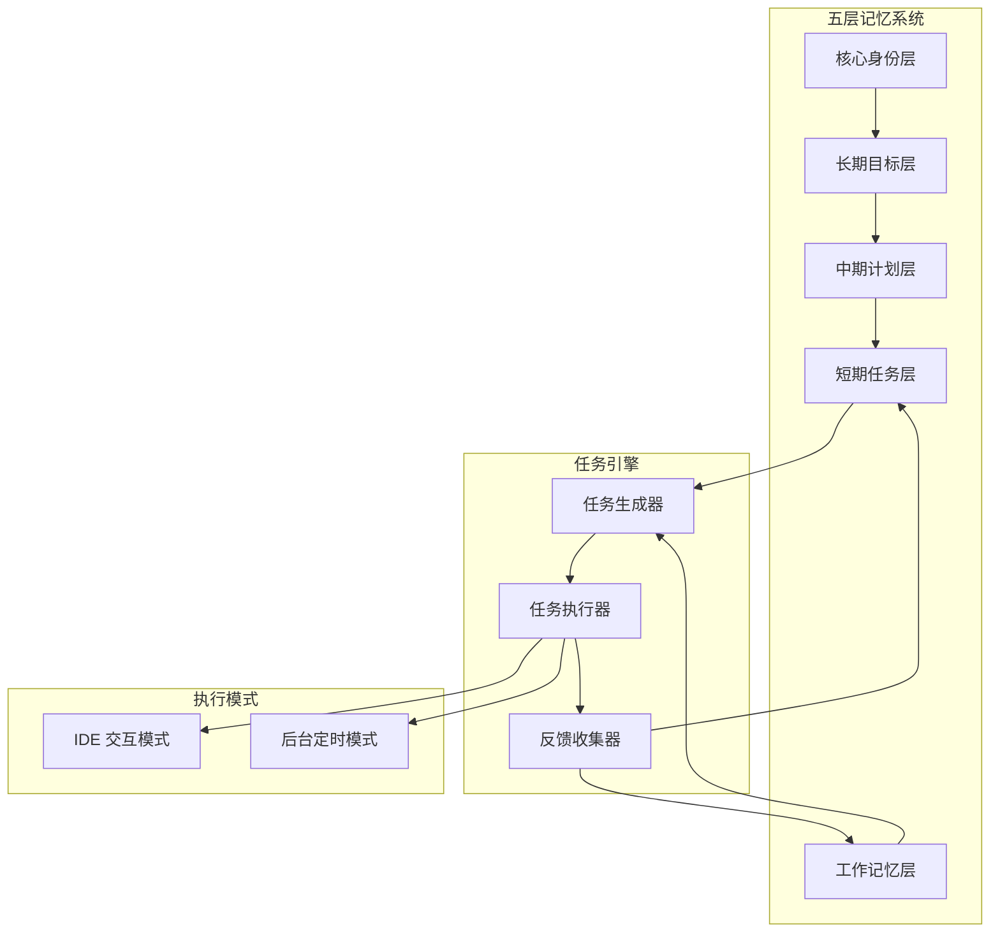

## Product Overview

为数字分身实现自主工作能力系统，基于五层记忆系统（核心身份、长期目标、中期计划、短期任务、工作记忆）自动生成每日任务计划。系统支持两种运行模式：IDE 交互执行和后台定时运行，用户可随时通过指令启动。任务执行过程完全自动化但可视化，用户能实时查看执行进度。通过每日反馈机制持续优化任务安排策略。

## Core Features

- 基于五层记忆系统的任务自动生成：从核心身份和长期目标出发，自动分解生成每日可执行任务（编码、工作、生活三类）
- 双模式执行引擎：支持 IDE 交互模式（实时可视化执行）和后台定时模式（自动化运行）
- 任务执行可视化：完全自动执行的同时，提供执行过程的实时展示和日志记录
- 每日反馈优化：收集任务完成情况，分析执行效果，持续优化任务生成策略
- 灵活启动机制：支持通过指令随时启动，不限定固定时间

## Tech Stack

- 运行环境：Node.js + TypeScript
- 任务调度：node-cron（后台定时模式）
- 数据存储：本地 JSON 文件（复用现有记忆系统结构）
- CLI 交互：Commander.js + Inquirer.js
- 日志可视化：Ora（进度展示）+ Chalk（彩色输出）

## Tech Architecture

### System Architecture



### Module Division

- **TaskGenerator 任务生成模块**：读取记忆系统，基于目标和计划自动分解生成每日任务列表
- **TaskExecutor 任务执行模块**：执行具体任务，支持编码、工作、生活三类任务的处理
- **ExecutionVisualizer 可视化模块**：实时展示任务执行进度和状态
- **FeedbackCollector 反馈收集模块**：收集执行结果，更新记忆系统
- **Scheduler 调度模块**：管理后台定时任务和手动触发

### Data Flow


## Implementation Details

### Core Directory Structure

```
src/
├── autonomous/
│   ├── index.ts              # 自主系统入口
│   ├── task-generator.ts     # 任务生成器
│   ├── task-executor.ts      # 任务执行器
│   ├── feedback-collector.ts # 反馈收集器
│   ├── scheduler.ts          # 调度器
│   ├── visualizer.ts         # 可视化展示
│   └── types.ts              # 类型定义
├── memory/                   # 复用现有记忆系统
└── cli/
    └── autonomous-cmd.ts     # CLI 命令入口
```

### Key Code Structures

**DailyTask 接口**：定义每日任务的数据结构，包含任务类型、优先级、预估时间等。

```typescript
interface DailyTask {
  id: string;
  type: 'coding' | 'work' | 'life';
  title: string;
  description: string;
  priority: 'high' | 'medium' | 'low';
  estimatedMinutes: number;
  status: 'pending' | 'running' | 'completed' | 'failed';
  sourceGoalId?: string;
  createdAt: Date;
}
```

**ExecutionResult 接口**：记录任务执行结果，用于反馈优化。

```typescript
interface ExecutionResult {
  taskId: string;
  success: boolean;
  actualMinutes: number;
  output?: string;
  feedback?: string;
  completedAt: Date;
}
```

### Technical Implementation Plan

1. **任务生成逻辑**

- 读取长期目标和中期计划
- 基于优先级和截止日期分解为每日任务
- 考虑历史完成率调整任务量

2. **双模式执行**

- IDE 模式：通过 CLI 命令启动，实时输出
- 后台模式：使用 node-cron 定时触发

3. **可视化实现**

- 使用 Ora 展示当前执行任务
- 使用 Chalk 区分任务类型和状态
- 日志持久化到文件

## Agent Extensions

### SubAgent

- **code-explorer**
- Purpose：分析现有记忆系统代码结构，理解五层记忆的数据格式和接口
- Expected outcome：获取记忆系统的完整结构，确保新模块能正确读写记忆数据