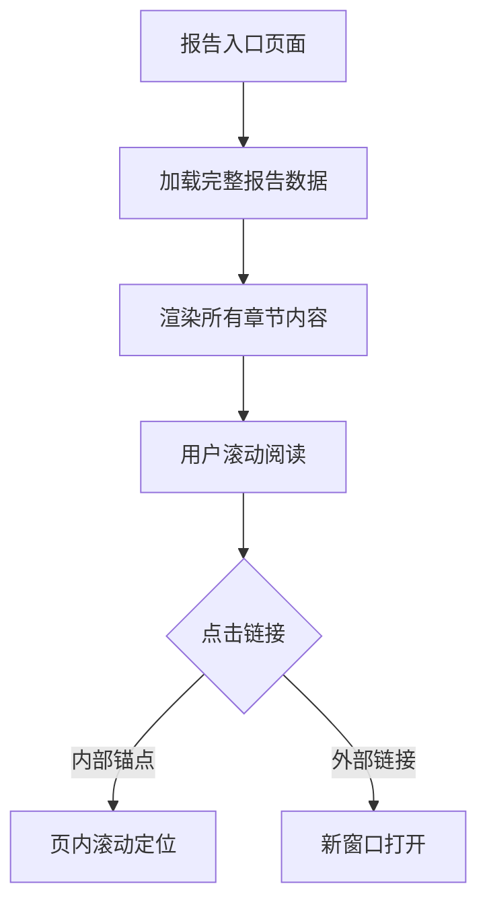

## 产品概述

将社区慈善报告的阅读模式从当前的"章节列表+逐个点击"改为"一页完整展示所有内容"的长文档阅读模式，提升用户阅读流畅度和体验。

## 核心功能

- **长文档一页展示**：将所有章节内容（执行摘要、政策背景、腾讯布局、深根者培训、相关项目、机会分析、建议方案等）在同一页面完整展示
- **章节内锚点导航**：保留章节标题作为页内锚点，支持快速定位到对应章节
- **外部链接跳转**：仅外部引用链接保留跳转功能，点击后在新窗口打开
- **阅读进度指示**：显示当前阅读位置和整体进度

## 技术栈

- 基于现有项目技术栈进行修改
- 复用现有的章节内容组件和样式

## 技术架构

### 数据流



### 模块划分

- **报告容器模块**：负责整体布局和章节内容的顺序渲染
- **章节内容模块**：复用现有章节详情组件，移除独立页面跳转逻辑
- **导航模块**：章节锚点导航和阅读进度指示
- **链接处理模块**：区分内部锚点和外部链接的点击行为

## 实现细节

### 核心目录结构

仅展示需要修改的文件：

```
src/
├── pages/
│   └── charity-report/
│       └── index.tsx          # 修改：改为长文档模式
├── components/
│   └── report/
│       ├── ReportSection.tsx  # 修改：移除点击跳转逻辑
│       └── SectionNav.tsx     # 新增：章节锚点导航组件
```

### 关键代码结构

**报告页面结构调整**：将章节列表渲染改为章节内容完整渲染

```typescript
// 修改前：章节列表项，点击跳转
<SectionListItem onClick={() => navigate(`/section/${id}`)} />

// 修改后：直接渲染章节完整内容
<ReportSection id={section.id} content={section.content} />
```

**链接处理逻辑**：

```typescript
// 链接点击处理
const handleLinkClick = (url: string) => {
  if (isExternalLink(url)) {
    window.open(url, '_blank');
  } else if (isAnchorLink(url)) {
    scrollToSection(url);
  }
};
```

### 技术实现要点

1. **移除章节点击跳转**：将章节卡片的点击事件移除，改为直接展示内容
2. **内容顺序渲染**：按章节顺序依次渲染所有内容到同一页面
3. **锚点定位**：为每个章节添加id锚点，支持页内快速定位
4. **外部链接识别**：通过URL判断是否为外部链接，外部链接新窗口打开

## Agent Extensions

### SubAgent

- **code-explorer**
- 用途：分析现有报告页面的代码结构，了解章节列表和详情页的实现方式
- 预期结果：获取现有组件结构、数据流和路由配置，为改造提供准确的修改方案