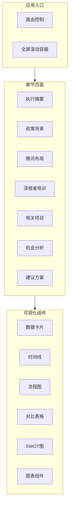

## Product Overview

将社区慈善报告改造为 PPT 风格的可视化网页呈现，采用"一屏一主题"的设计理念，通过卡片、数据大字、时间线、图表等现代化组件替代传统纯文字排版，在保留报告完整内容的前提下，大幅提升阅读体验和信息传达效率。

## Core Features

- **执行摘要屏**：使用数据大字卡片展示关键指标，配合图标和进度环形图，一目了然呈现核心数据
- **政策背景屏**：采用垂直时间线组件展示政策演进历程，辅以对比表格呈现政策要点
- **腾讯布局屏**：通过数据统计卡片群和架构关系图展示腾讯在慈善领域的战略布局
- **深根者培训屏**：使用横向流程图展示培训体系，配合案例卡片突出典型成果
- **相关项目屏**：采用项目对比表格和关系网络图展示项目间的联系与差异
- **机会分析屏**：使用 SWOT 四象限卡片布局，直观呈现优势、劣势、机会、威胁
- **建议方案屏**：通过行动计划时间表和优先级卡片展示具体建议和实施路径

## Tech Stack

- 前端框架：React + TypeScript
- 样式方案：Tailwind CSS
- 组件库：shadcn/ui
- 图表库：Recharts（用于数据可视化图表）
- 动画库：Framer Motion（用于页面切换和元素动画）
- 全屏滚动：react-full-page（实现 PPT 式一屏一页效果）

## Tech Architecture

### System Architecture

采用组件化单页应用架构，每个章节作为独立的全屏页面组件，通过全屏滚动库实现 PPT 式的页面切换效果。



### Module Division

- **FullPageContainer 模块**：全屏滚动容器，管理页面切换动画和导航指示器
- **Section 页面模块**：7 个独立的章节页面组件，每个负责一屏内容的布局和渲染
- **Visualization 组件模块**：可复用的可视化组件（数据卡片、时间线、流程图、表格、SWOT 图等）
- **Data 数据模块**：报告内容的结构化数据定义和管理

### Data Flow

报告数据（JSON/TS） -> Section 页面组件 -> Visualization 可视化组件 -> 用户交互（滚动/点击）

## Implementation Details

### Core Directory Structure

```
src/
├── components/
│   ├── layout/
│   │   ├── FullPageContainer.tsx    # 全屏滚动容器
│   │   ├── SectionWrapper.tsx       # 章节通用包装器
│   │   └── Navigation.tsx           # 侧边导航指示器
│   ├── visualizations/
│   │   ├── DataCard.tsx             # 数据大字卡片
│   │   ├── StatGroup.tsx            # 统计数据组
│   │   ├── Timeline.tsx             # 时间线组件
│   │   ├── FlowChart.tsx            # 流程图组件
│   │   ├── CompareTable.tsx         # 对比表格
│   │   ├── SwotChart.tsx            # SWOT四象限图
│   │   ├── RelationGraph.tsx        # 关系网络图
│   │   └── ActionPlanTable.tsx      # 行动计划表
│   └── ui/                          # shadcn/ui 组件
├── sections/
│   ├── ExecutiveSummary.tsx         # 执行摘要
│   ├── PolicyBackground.tsx         # 政策背景
│   ├── TencentLayout.tsx            # 腾讯布局
│   ├── TrainingProgram.tsx          # 深根者培训
│   ├── RelatedProjects.tsx          # 相关项目
│   ├── OpportunityAnalysis.tsx      # 机会分析
│   └── Recommendations.tsx          # 建议方案
├── data/
│   └── reportData.ts                # 报告结构化数据
├── hooks/
│   └── useFullPage.ts               # 全屏滚动钩子
└── App.tsx
```

### Key Code Structures

**报告数据接口定义**：定义各章节数据结构，确保类型安全和数据一致性。

```typescript
interface ReportData {
  executiveSummary: {
    keyMetrics: MetricItem[];
    highlights: string[];
  };
  policyBackground: {
    timeline: TimelineEvent[];
    policyTable: PolicyItem[];
  };
  tencentLayout: {
    stats: StatItem[];
    architecture: ArchitectureNode[];
  };
  // ... 其他章节
}

interface MetricItem {
  label: string;
  value: string | number;
  unit?: string;
  icon?: string;
  trend?: 'up' | 'down' | 'stable';
}
```

**全屏滚动容器组件**：管理页面切换和动画效果。

```typescript
interface FullPageContainerProps {
  children: React.ReactNode[];
  onSectionChange?: (index: number) => void;
}
```

### Technical Implementation Plan

1. **全屏滚动实现**

- 使用 react-full-page 或自定义实现全屏滚动
- 添加页面切换动画（Framer Motion）
- 实现侧边导航指示器和键盘/触摸支持

2. **可视化组件开发**

- 基于 shadcn/ui 封装数据卡片、表格等基础组件
- 使用 Recharts 实现图表类组件
- 确保组件响应式适配不同屏幕

3. **动画与交互**

- 页面进入时的元素渐入动画
- 数据数字的计数动画效果
- 时间线和流程图的逐步展示动画

## Design Style

采用现代商务演示风格，融合 Glassmorphism 和 Minimalism 设计理念，打造专业、优雅且富有视觉冲击力的 PPT 式阅读体验。

### 整体设计原则

- 一屏一主题：每个章节独占一屏，信息聚焦，避免滚动疲劳
- 数据可视化优先：用图表、数字、图标替代大段文字
- 层次分明：通过卡片、阴影、渐变区分信息层级
- 动态交互：页面切换和元素出现时的流畅动画

### 章节页面设计

**第一屏 - 执行摘要**

- 顶部：大标题 + 副标题
- 中心区域：4-6 个数据大字卡片网格布局，每个卡片包含图标、数字、标签
- 数字采用渐变色和计数动画，突出视觉冲击力
- 底部：关键亮点以标签形式排列

**第二屏 - 政策背景**

- 左侧：垂直时间线，节点带年份和事件标题
- 右侧：政策要点对比表格，使用斑马纹和高亮行
- 时间线采用渐进展示动画

**第三屏 - 腾讯布局**

- 上半部分：统计数据卡片群（3-4 个），带图标和趋势指示
- 下半部分：架构关系图，使用节点和连线展示业务布局
- 卡片采用 Glassmorphism 效果

**第四屏 - 深根者培训**

- 顶部：横向流程图展示培训阶段
- 下方：案例卡片网格，每个卡片包含标题、描述、成果数据
- 流程图节点带图标和进度指示

**第五屏 - 相关项目**

- 左侧：项目对比表格，支持多维度对比
- 右侧：项目关系网络图，展示项目间的关联
- 表格支持悬浮高亮效果

**第六屏 - 机会分析**

- 中心：SWOT 四象限布局，每个象限一个颜色主题
- 每个象限内部使用列表或标签展示具体内容
- 四象限带入场动画，依次展开

**第七屏 - 建议方案**

- 上方：行动计划甘特图或时间表
- 下方：优先级分组的建议卡片
- 卡片带优先级标签和负责方标识

## Agent Extensions

### SubAgent

- **code-explorer**
- Purpose: 探索现有项目结构，了解当前代码组织方式和技术栈配置
- Expected outcome: 获取项目目录结构、已有组件和样式配置，确保新增代码与现有架构一致