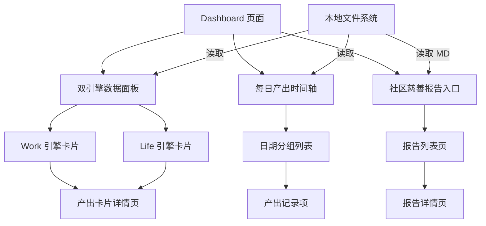
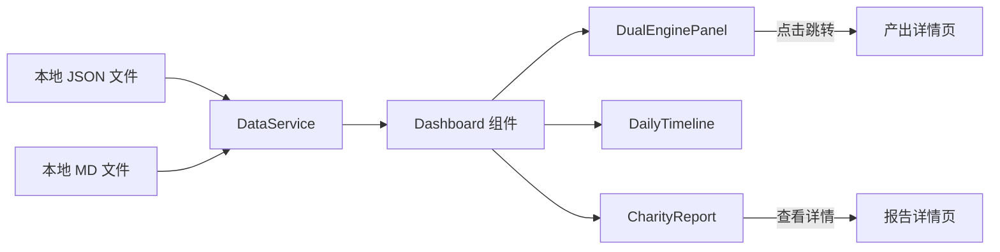

## Product Overview

改造现有 Dashboard 页面，在保留双引擎（Work/Life）数据面板的基础上增强交互体验，新增每日产出时间轴区块，并接入社区慈善报告，实现所有产出物的统一展示和便捷查看。

## Core Features

- **双引擎数据面板优化**：保留 Work 和 Life 两个引擎的数据面板，展示任务总数、累计完成数、当日完成数；点击已完成数字可跳转至对应的产出卡片详情页
- **每日产出时间轴**：在双引擎面板下方新增时间轴区块，按日期倒序展示产出记录，默认展开当天内容，支持折叠/展开历史日期
- **社区慈善报告接入**：将 7 个 Markdown 格式的社区慈善报告接入前端，支持列表查看和详情阅读
- **数据稳定读取**：所有数据从本地文件读取，确保展示稳定可靠

## Tech Stack

- 前端框架：基于现有项目技术栈（需分析项目确认）
- 数据读取：本地文件系统读取 JSON/Markdown 文件
- Markdown 渲染：集成 Markdown 解析库用于慈善报告展示

## Tech Architecture

### System Architecture



### Module Division

- **DualEnginePanel 模块**：双引擎数据面板组件，负责展示 Work/Life 统计数据，处理点击跳转逻辑
- **DailyTimeline 模块**：每日产出时间轴组件，按日期分组展示产出记录，支持折叠展开
- **CharityReport 模块**：社区慈善报告模块，包含报告列表和 Markdown 详情渲染
- **DataService 模块**：数据服务层，负责从本地文件读取和解析数据

### Data Flow



## Implementation Details

### Core Directory Structure

基于现有项目结构，新增/修改以下文件：

```
src/
├── components/
│   ├── dashboard/
│   │   ├── DualEnginePanel.tsx      # 新增：双引擎数据面板
│   │   ├── EngineCard.tsx           # 新增：单个引擎卡片
│   │   ├── DailyTimeline.tsx        # 新增：每日产出时间轴
│   │   ├── TimelineItem.tsx         # 新增：时间轴单项
│   │   └── CharityReportList.tsx    # 新增：慈善报告列表
│   └── markdown/
│       └── MarkdownViewer.tsx       # 新增：Markdown 渲染组件
├── pages/
│   ├── Dashboard.tsx                # 修改：集成新组件
│   ├── OutputDetail.tsx             # 新增/修改：产出详情页
│   └── CharityReportDetail.tsx      # 新增：报告详情页
├── services/
│   └── dataService.ts               # 新增：数据读取服务
└── types/
    └── dashboard.ts                 # 新增：类型定义
```

### Key Code Structures

**Dashboard 数据类型定义**：定义双引擎面板和时间轴所需的核心数据结构。

```typescript
// 引擎统计数据
interface EngineStats {
  type: 'work' | 'life';
  totalTasks: number;
  totalCompleted: number;
  todayCompleted: number;
}

// 产出记录
interface OutputRecord {
  id: string;
  title: string;
  type: 'work' | 'life';
  createdAt: string;
  category: string;
}

// 按日期分组的产出
interface DailyOutput {
  date: string;
  records: OutputRecord[];
}

// 慈善报告
interface CharityReport {
  id: string;
  title: string;
  filename: string;
  date: string;
}
```

**数据服务接口**：提供统一的数据读取方法。

```typescript
class DataService {
  async getEngineStats(): Promise<EngineStats[]> { }
  async getDailyOutputs(): Promise<DailyOutput[]> { }
  async getCharityReports(): Promise<CharityReport[]> { }
  async getReportContent(filename: string): Promise<string> { }
}
```

### Technical Implementation Plan

**1. 双引擎面板交互增强**

- 问题：需要在现有面板基础上添加点击跳转功能
- 方案：为已完成数字添加可点击样式和路由跳转
- 实现步骤：封装 EngineCard 组件 → 添加点击事件 → 配置路由参数 → 跳转至产出详情页

**2. 每日产出时间轴**

- 问题：需要按日期分组展示产出记录，支持折叠展开
- 方案：使用手风琴组件模式，默认展开当天
- 实现步骤：数据按日期分组 → 实现折叠组件 → 渲染时间轴样式 → 处理展开状态

**3. Markdown 报告渲染**

- 问题：需要将 7 个 MD 文件渲染为可阅读的 HTML
- 方案：使用 Markdown 解析库进行渲染
- 实现步骤：读取 MD 文件 → 解析为 HTML → 应用样式 → 展示详情页

## Agent Extensions

### SubAgent

- **code-explorer**
- Purpose：分析现有 Dashboard 页面结构和项目技术栈，了解当前组件实现方式和数据流
- Expected outcome：获取项目技术栈信息、现有 Dashboard 组件结构、路由配置方式，为改造提供准确的技术基础