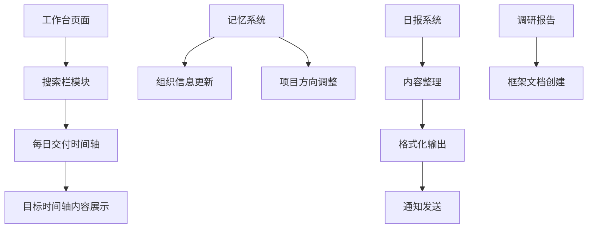

## Product Overview

本次任务包含4个独立但相关的工作项目，涉及工作台页面改造、记忆系统更新、日报生成发送以及调研报告框架创建。

## Core Features

### 1. 工作台页面整合目标时间轴

- 将现有"交付物管理中心"模块替换为"每日交付时间轴"
- 在搜索栏下方直接展示目标时间轴内容
- 时间轴以可视化方式呈现每日目标和交付物进度

### 2. 记忆系统更新

- 更新组织架构变化信息
- 调整善治美项目状态：保持active但方向转为社区慈善相关
- 记录新的工作方向和重点领域

### 3. 昨日日报生成与发送

- 按照标准格式生成日报：做了什么、为什么、做到怎样、下一步
- 整理昨日完成的工作内容
- 通过配置的通知渠道发送日报

### 4. 社区慈善调研报告框架

- 创建结构化的调研报告文档框架
- 包含深根者培训等核心内容模块
- 为后续调研内容填充提供标准模板

## Tech Stack

- 前端框架：基于现有项目技术栈
- 文档格式：Markdown
- 通知推送：企业微信群机器人/邮箱SMTP

## Tech Architecture

### 系统架构

本次任务涉及现有工作台页面的局部改造和文档创建，无需引入新的架构模式。



### 模块划分

#### 工作台时间轴模块

- 职责：展示每日目标和交付物时间轴
- 位置：搜索栏下方区域
- 替换原有"交付物管理中心"模块

#### 日报生成模块

- 职责：按标准格式生成日报内容
- 格式：做了什么、为什么、做到怎样、下一步
- 输出：Markdown格式文档

#### 调研报告模块

- 职责：提供结构化报告框架
- 内容：社区慈善调研相关章节

### 数据流

1. 工作台改造：读取目标时间轴数据 → 渲染时间轴组件 → 展示在搜索栏下方
2. 日报流程：整理工作内容 → 格式化为标准模板 → 发送通知
3. 报告创建：定义框架结构 → 创建Markdown文档 → 保存到项目目录

## Implementation Details

### 核心目录结构

```
project-root/
├── src/
│   └── pages/
│       └── dashboard/          # 工作台页面改造
├── docs/
│   ├── daily-reports/          # 日报存放目录
│   │   └── 2024-xx-xx.md       # 昨日日报
│   └── research/               # 调研报告目录
│       └── community-charity-research.md  # 社区慈善调研报告
└── memory/                     # 记忆系统配置
    └── project-status.md       # 项目状态更新
```

### 日报模板结构

```markdown
# 日报 - [日期]

## 做了什么
- [具体工作内容]

## 为什么
- [工作目的和背景]

## 做到怎样
- [完成情况和成果]

## 下一步
- [后续计划]
```

### 调研报告框架结构

```markdown
# 社区慈善调研报告

## 1. 调研背景
## 2. 深根者培训
## 3. 社区慈善模式分析
## 4. 实施建议
## 5. 总结
```

## Agent Extensions

### Skill

- **notification-setup**
- Purpose：配置日报发送的通知渠道（企业微信群机器人或邮箱SMTP）
- Expected outcome：完成通知推送配置，确保日报能够成功发送

### SubAgent

- **code-explorer**
- Purpose：探索现有工作台页面代码结构，了解当前"交付物管理中心"模块的实现方式
- Expected outcome：获取工作台页面的代码结构和组件信息，为改造提供依据