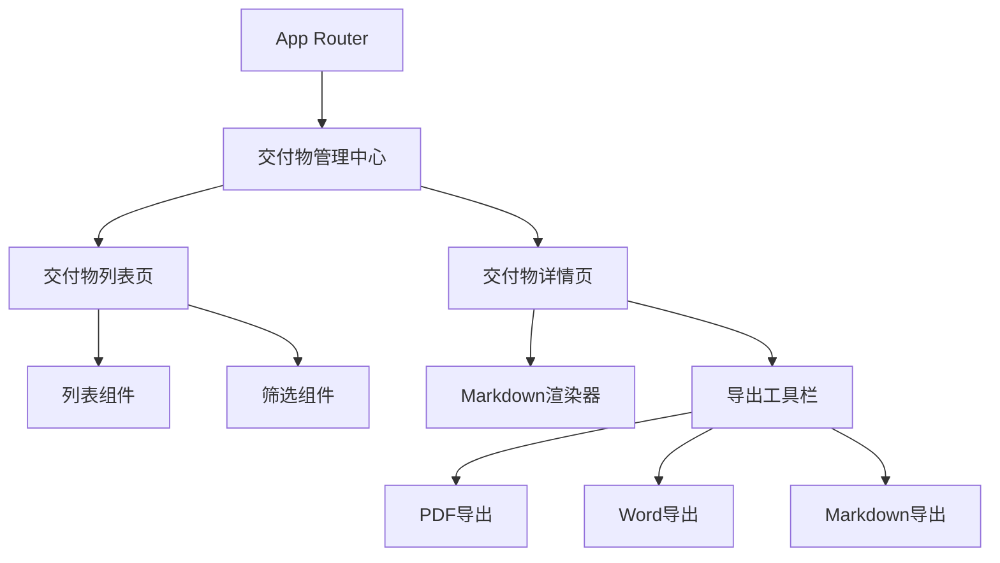

## 产品概述

数字分身交付物管理中心是一个集成在现有 React 项目中的通用交付物管理平台，用于可视化展示、管理和导出各类项目成果文档。首期将集成 AI 动画调研报告，支持在线浏览和多格式导出，未来可扩展添加更多交付物类型。

## 核心功能

- **交付物列表展示**：以卡片或列表形式展示所有交付物，支持分类筛选和搜索
- **在线文档浏览**：支持 Markdown 格式文档的在线渲染和阅读，提供良好的排版效果
- **多格式导出**：支持将交付物导出为 PDF、Word、Markdown 三种格式
- **交付物详情页**：展示单个交付物的完整内容，包含目录导航和章节跳转
- **可扩展架构**：预留交付物类型扩展接口，便于未来添加新的项目成果

## 技术选型

- 前端框架：React + TypeScript（复用现有项目技术栈）
- 样式方案：Tailwind CSS
- Markdown 渲染：react-markdown + remark-gfm
- PDF 导出：html2pdf.js 或 jspdf
- Word 导出：docx 库
- 路由：React Router（复用现有配置）

## 技术架构

### 系统架构

采用模块化组件架构，与现有项目无缝集成，遵循现有项目的目录结构和代码规范。



### 模块划分

- **页面模块**：交付物列表页、交付物详情页
- **组件模块**：交付物卡片、筛选栏、导出工具栏、Markdown 渲染器、目录导航
- **服务模块**：导出服务（PDF/Word/Markdown）、交付物数据服务
- **类型模块**：交付物数据结构定义

### 数据流

用户访问列表页 → 加载交付物数据 → 点击查看详情 → 渲染 Markdown 内容 → 选择导出格式 → 生成并下载文件

## 实现细节

### 核心目录结构

```
src/
├── pages/
│   └── deliverables/
│       ├── index.tsx              # 交付物列表页
│       └── [id].tsx               # 交付物详情页
├── components/
│   └── deliverables/
│       ├── DeliverableCard.tsx    # 交付物卡片组件
│       ├── DeliverableFilter.tsx  # 筛选组件
│       ├── MarkdownRenderer.tsx   # Markdown渲染组件
│       ├── ExportToolbar.tsx      # 导出工具栏
│       └── TableOfContents.tsx    # 目录导航组件
├── services/
│   └── deliverables/
│       ├── exportService.ts       # 导出服务
│       └── deliverableService.ts  # 数据服务
├── types/
│   └── deliverable.ts             # 类型定义
└── data/
    └── deliverables/
        └── ai-animation-report.md # AI动画调研报告
```

### 关键代码结构

**交付物数据结构**：定义交付物的核心数据模型，包含标识、元信息和内容路径。

```typescript
interface Deliverable {
  id: string;
  title: string;
  category: string;
  description: string;
  createdAt: string;
  updatedAt: string;
  contentPath: string;
  tags: string[];
}
```

**导出服务接口**：提供统一的导出功能接口，支持多种格式转换。

```typescript
class ExportService {
  async exportToPDF(content: string, filename: string): Promise<void>;
  async exportToWord(content: string, filename: string): Promise<void>;
  async exportToMarkdown(content: string, filename: string): Promise<void>;
}
```

### 技术实现要点

1. **Markdown 渲染**：使用 react-markdown 配合 remark-gfm 插件支持 GFM 语法
2. **PDF 导出**：将渲染后的 HTML 内容通过 html2pdf.js 转换为 PDF
3. **Word 导出**：使用 docx 库将 Markdown 解析后生成 Word 文档
4. **目录导航**：解析 Markdown 标题生成目录，支持锚点跳转

## 设计风格

采用现代简约的文档管理风格，以清晰的信息层级和舒适的阅读体验为核心。界面设计注重内容展示，使用卡片式布局呈现交付物列表，详情页采用双栏布局（左侧目录 + 右侧内容）。

## 页面设计

### 交付物列表页

- **顶部导航栏**：页面标题、搜索框、返回主站入口
- **筛选区域**：分类标签筛选、排序选项
- **内容区域**：卡片网格布局展示交付物，每张卡片包含标题、描述、分类标签、更新时间
- **空状态**：无交付物时展示引导提示

### 交付物详情页

- **顶部工具栏**：返回按钮、文档标题、导出按钮组（PDF/Word/Markdown）
- **左侧目录栏**：固定定位的目录导航，高亮当前阅读章节
- **右侧内容区**：Markdown 渲染内容，优化排版和代码高亮
- **底部信息**：更新时间、相关标签

## Agent Extensions

### SubAgent

- **code-explorer**
- 用途：分析现有 React 项目结构、路由配置和代码规范
- 预期结果：获取项目目录结构、现有组件模式和样式方案，确保新模块与现有代码风格一致