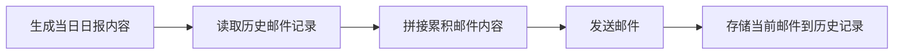

## Product Overview

实现日报邮件内容累积功能，每封新发送的日报邮件正文中自动包含历史所有日报内容。通过分隔线和引用样式展示历史邮件，使用户在一封邮件中即可查看完整的日报历史记录。

## Core Features

- 历史邮件内容存储：持久化存储每次发送的日报HTML内容，支持按时间顺序检索
- 邮件内容累积拼接：新日报发送时，自动在正文下方添加分隔线，并以引用样式追加所有历史日报内容
- 分隔线与引用样式：使用清晰的视觉分隔线区分当前日报与历史日报，历史内容采用引用块样式展示
- 时间戳标记：每段历史日报内容前添加发送时间标记，便于用户快速定位

## Tech Stack

- 运行环境：Node.js
- 数据存储：本地JSON文件持久化存储历史邮件内容
- 邮件发送：现有SMTP邮件发送模块

## Tech Architecture

### System Architecture

基于现有项目架构进行扩展，新增历史邮件存储模块，在邮件发送流程中集成内容累积逻辑。



### Module Division

- **历史邮件存储模块**：负责历史邮件内容的读取、写入和管理
- 技术：Node.js fs模块 + JSON文件存储
- 接口：loadHistory()、saveHistory()、clearHistory()
- **邮件内容拼接模块**：负责将当前日报与历史日报内容按格式拼接
- 技术：HTML字符串拼接
- 接口：buildAccumulatedContent()

### Data Flow

1. 触发日报发送 -> 生成当日日报HTML内容
2. 调用历史存储模块读取所有历史邮件记录
3. 调用拼接模块，将当前日报 + 分隔线 + 历史日报引用内容组合
4. 发送累积后的完整邮件
5. 将当前日报内容追加到历史记录并持久化存储

## Implementation Details

### Core Directory Structure

```
project-root/
├── src/
│   ├── services/
│   │   └── emailHistoryService.ts  # 新增：历史邮件存储服务
│   └── utils/
│       └── emailContentBuilder.ts  # 新增：邮件内容拼接工具
├── data/
│   └── email-history.json          # 新增：历史邮件存储文件
```

### Key Code Structures

**EmailHistoryRecord 接口**：定义单条历史邮件记录的数据结构，包含发送时间和HTML内容。

```typescript
interface EmailHistoryRecord {
  timestamp: string;      // ISO格式时间戳
  subject: string;        // 邮件主题
  htmlContent: string;    // 邮件HTML正文
}
```

**EmailHistoryService 类**：提供历史邮件的持久化存储和读取功能。

```typescript
class EmailHistoryService {
  private historyFilePath: string;
  
  async loadHistory(): Promise<EmailHistoryRecord[]> { }
  async saveToHistory(record: EmailHistoryRecord): Promise<void> { }
  async clearHistory(): Promise<void> { }
}
```

**buildAccumulatedContent 函数**：将当前日报内容与历史日报内容拼接，生成累积邮件HTML。

```typescript
function buildAccumulatedContent(
  currentContent: string,
  historyRecords: EmailHistoryRecord[]
): string {
  // 返回：当前内容 + 分隔线 + 历史引用内容
}
```

### Technical Implementation Plan

**问题1：历史邮件内容存储**

- 解决方案：使用本地JSON文件存储历史记录数组
- 关键技术：Node.js fs模块异步读写
- 实现步骤：

1. 创建EmailHistoryService服务类
2. 实现loadHistory读取JSON文件
3. 实现saveToHistory追加记录并写入文件
4. 处理文件不存在时的初始化逻辑

**问题2：邮件内容累积拼接**

- 解决方案：HTML字符串拼接，使用分隔线和blockquote样式
- 关键技术：HTML模板字符串
- 实现步骤：

1. 创建buildAccumulatedContent工具函数
2. 定义分隔线HTML样式（hr标签 + 文字说明）
3. 将历史内容包装在blockquote引用块中
4. 按时间倒序排列历史内容（最近的在前）

### Integration Points

- 在现有邮件发送逻辑中，发送前调用内容拼接函数
- 发送成功后调用历史存储服务保存当前邮件