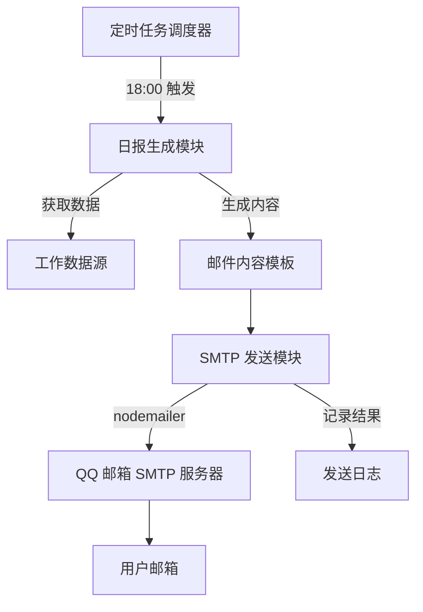

## Product Overview

配置 QQ 邮箱 SMTP 推送服务，实现数字分身系统每日定时自动发送工作日报到用户指定邮箱。系统将在每天 18:00 自动汇总当日工作内容，通过邮件形式推送给用户。

## Core Features

- QQ 邮箱 SMTP 服务配置：使用用户提供的邮箱地址和授权码配置 SMTP 发送服务
- 邮件发送功能：支持 HTML 格式的工作日报邮件发送
- 定时任务调度：每日 18:00 自动触发日报生成和发送
- 日报内容生成：汇总当日工作任务、完成情况等信息生成结构化日报
- 发送状态记录：记录邮件发送结果，支持发送失败重试

## Tech Stack

- 运行环境：Node.js
- 邮件发送：nodemailer（SMTP 客户端）
- 定时任务：node-cron 或 node-schedule
- 配置管理：环境变量 + 配置文件

## Tech Architecture

### System Architecture



### Module Division

- **配置模块**：管理 SMTP 连接配置（邮箱地址、授权码、服务器信息）
- **邮件发送模块**：封装 nodemailer，提供邮件发送能力
- **定时任务模块**：管理定时触发逻辑，每日 18:00 执行
- **日报生成模块**：汇总工作数据，生成 HTML 格式日报内容

### Data Flow

1. 定时任务在 18:00 触发日报生成流程
2. 日报生成模块收集当日工作数据
3. 使用 HTML 模板渲染日报内容
4. 调用 SMTP 发送模块发送邮件
5. 记录发送结果，失败时进行重试

## Implementation Details

### Core Directory Structure

```
project-root/
├── src/
│   ├── config/
│   │   └── email.config.ts      # 邮箱 SMTP 配置
│   ├── services/
│   │   ├── emailService.ts      # 邮件发送服务
│   │   ├── reportService.ts     # 日报生成服务
│   │   └── schedulerService.ts  # 定时任务服务
│   ├── templates/
│   │   └── dailyReport.html     # 日报邮件模板
│   └── utils/
│       └── logger.ts            # 日志工具
├── .env                         # 环境变量配置
└── package.json
```

### Key Code Structures

**邮箱配置接口**：定义 SMTP 连接所需的配置信息

```typescript
interface EmailConfig {
  host: string;           // smtp.qq.com
  port: number;           // 465 (SSL) 或 587 (TLS)
  secure: boolean;        // true for 465
  auth: {
    user: string;         // 发件邮箱地址
    pass: string;         // SMTP 授权码
  };
}
```

**邮件发送服务**：封装 nodemailer 提供统一的邮件发送接口

```typescript
class EmailService {
  async sendDailyReport(content: string): Promise<boolean>;
  async testConnection(): Promise<boolean>;
}
```

### Technical Implementation Plan

1. **SMTP 配置**

- 配置 QQ 邮箱 SMTP 服务器地址：smtp.qq.com
- 端口使用 465（SSL）或 587（TLS）
- 使用用户提供的授权码进行身份验证

2. **邮件发送**

- 使用 nodemailer 创建 transporter
- 支持 HTML 格式邮件内容
- 实现发送失败重试机制

3. **定时任务**

- 使用 cron 表达式：`0 18 * * *`（每日 18:00）
- 支持手动触发测试

### Security Measures

- SMTP 授权码存储在环境变量中，不硬编码
- 使用 SSL/TLS 加密连接
- 日志中脱敏敏感信息

## Agent Extensions

### Skill

- **notification-setup**
- Purpose：指导配置 QQ 邮箱 SMTP 推送服务，获取标准化的配置流程和代码实现
- Expected outcome：获得完整的邮箱 SMTP 配置指南、nodemailer 配置代码和定时任务实现方案