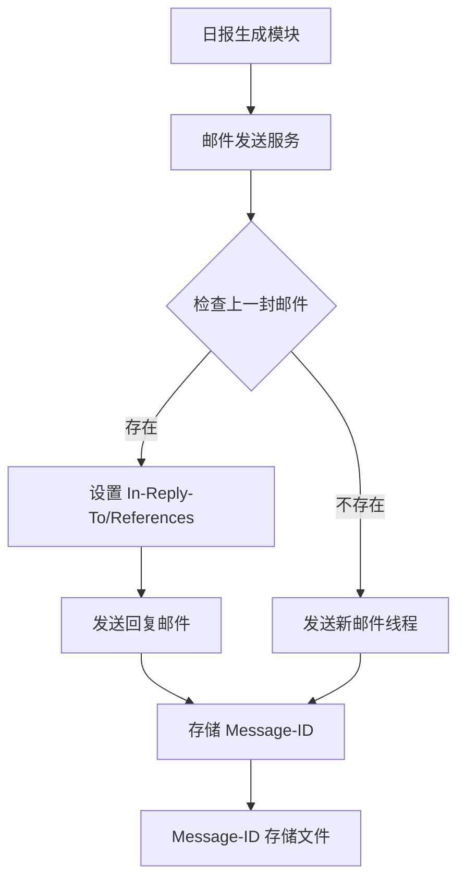

## Product Overview

实现邮件回复链功能，使每封新日报邮件自动回复上一封日报邮件，形成连续的邮件会话线程。用户可以在邮箱客户端中自然地查看完整的日报历史记录，无需额外的排版处理。

## Core Features

- **邮件回复链机制**：每封新日报邮件自动设置为回复上一封日报，通过邮件头部的 In-Reply-To 和 References 字段建立关联
- **Message-ID 存储与检索**：存储每封已发送日报的 Message-ID，供下一封邮件回复时使用
- **邮件客户端原生引用**：利用邮件客户端自带的引用功能自动保留历史内容，无需手动处理
- **会话线程展示**：用户在邮箱中可以看到日报邮件自动归组为一个会话线程，方便追溯历史

## Tech Stack

- 运行环境：Node.js + TypeScript
- 邮件发送：nodemailer（已有依赖）
- 数据存储：本地 JSON 文件存储 Message-ID 记录

## Tech Architecture

### System Architecture

本功能基于现有的邮件推送服务进行扩展，新增 Message-ID 管理模块，实现邮件回复链功能。



### Module Division

- **Message-ID 管理模块**：负责存储和检索已发送邮件的 Message-ID
- 主要技术：Node.js fs 模块、JSON 文件存储
- 依赖：无外部依赖
- 接口：getLastMessageId()、saveMessageId()

- **邮件发送模块（扩展）**：在现有邮件发送逻辑中增加回复链支持
- 主要技术：nodemailer
- 依赖：Message-ID 管理模块
- 接口：sendEmailWithReplyChain()

### Data Flow


## Implementation Details

### Core Directory Structure

基于现有项目结构，新增以下文件：

```
project-root/
├── src/
│   ├── services/
│   │   └── messageIdStore.ts    # 新增：Message-ID 存储管理
│   └── utils/
│       └── emailReplyChain.ts   # 新增：邮件回复链工具函数
├── data/
│   └── message-ids.json         # 新增：Message-ID 存储文件
```

### Key Code Structures

**MessageIdRecord 接口**：定义存储的 Message-ID 记录结构，包含邮件标识、发送时间和主题信息，用于追踪邮件历史。

```typescript
interface MessageIdRecord {
  messageId: string;      // 邮件唯一标识
  sentAt: string;         // 发送时间 ISO 格式
  subject: string;        // 邮件主题
  recipient: string;      // 收件人
}
```

**邮件头部设置**：通过 nodemailer 的 messageId、inReplyTo 和 references 选项实现回复链。

```typescript
interface ReplyChainMailOptions {
  inReplyTo?: string;     // 上一封邮件的 Message-ID
  references?: string[];  // 整个邮件链的 Message-ID 列表
  messageId?: string;     // 当前邮件的 Message-ID（可选，nodemailer 会自动生成）
}
```

### Technical Implementation Plan

**问题1：如何建立邮件回复链**

- 解决方案：使用邮件头部的 In-Reply-To 和 References 字段
- 关键技术：nodemailer 的 inReplyTo 和 references 配置项
- 实现步骤：

1. 发送前读取上一封邮件的 Message-ID
2. 设置 In-Reply-To 为上一封的 Message-ID
3. 设置 References 为完整的 Message-ID 链
4. 发送后保存新邮件的 Message-ID

**问题2：如何持久化存储 Message-ID**

- 解决方案：使用本地 JSON 文件存储，按收件人分组
- 关键技术：Node.js fs 模块的读写操作
- 实现步骤：

1. 创建 data 目录和 message-ids.json 文件
2. 实现读取和写入函数
3. 按收件人邮箱地址作为 key 存储最新 Message-ID

### Integration Points

- 与现有邮件发送服务集成，在发送函数中增加回复链逻辑
- 数据格式：JSON 文件存储 Message-ID 记录
- 无需外部服务依赖