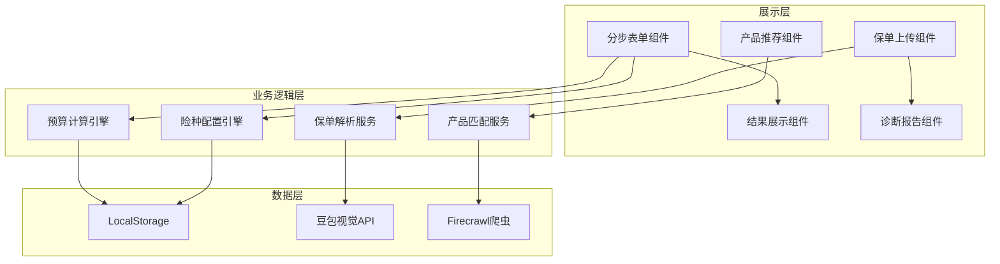

## 产品概述

家庭保险规划师是一款移动端优先的保险规划工具，通过分步引导式交互帮助用户完成保险需求分析、预算规划、险种配置和产品推荐。工具采用业内公认的方法论（双十原则、生命价值法等）进行科学计算，支持已有保单的智能诊断功能，为家庭用户提供专业、易用的保险规划服务。

## 核心功能

1. **家庭信息采集**：通过简洁的分步表单收集家庭成员基本信息（年龄、收入、健康状况等），支持多成员管理
2. **保险预算计算**：基于双十原则和生命价值法，智能计算家庭年度保费预算和保额需求
3. **险种配置方案**：根据家庭情况自动生成四大核心险种（重疾险、医疗险、意外险、寿险）的配置建议和优先级排序
4. **产品实时推荐**：联网抓取主流保险平台的热门产品，根据用户需求进行智能匹配和对比展示
5. **保单智能诊断**：支持上传保单图片或PDF，通过AI识别提取关键信息，分析保障缺口并给出优化建议
6. **规划报告生成**：汇总所有分析结果，生成可分享的家庭保险规划报告

## 技术选型

- **前端框架**：React + TypeScript
- **样式方案**：Tailwind CSS
- **组件库**：shadcn/ui
- **数据存储**：LocalStorage（本地缓存用户数据）
- **AI能力**：豆包视觉（保单识别）
- **数据抓取**：Firecrawl（产品信息爬取）

## 技术架构

### 系统架构

采用分层架构设计，分为展示层、业务逻辑层和数据层，确保代码可维护性和扩展性。



### 模块划分

| 模块名称 | 主要职责 | 核心技术 |
| --- | --- | --- |
| 信息采集模块 | 分步收集家庭成员信息 | React Hook Form |
| 预算计算模块 | 双十原则/生命价值法计算 | TypeScript 算法 |
| 险种配置模块 | 四大险种分配建议 | 规则引擎 |
| 产品推荐模块 | 实时抓取产品数据 | Firecrawl |
| 保单诊断模块 | 图片/PDF识别解析 | 豆包视觉 |
| 报告生成模块 | 汇总并导出规划报告 | PDF生成 |


### 数据流


## 实现细节

### 核心目录结构

```
project-root/
├── src/
│   ├── components/
│   │   ├── steps/           # 分步表单组件
│   │   ├── insurance/       # 险种相关组件
│   │   ├── diagnosis/       # 保单诊断组件
│   │   └── ui/              # 通用UI组件
│   ├── services/
│   │   ├── calculator.ts    # 预算计算服务
│   │   ├── allocator.ts     # 险种配置服务
│   │   ├── scraper.ts       # 产品抓取服务
│   │   └── ocr.ts           # 保单识别服务
│   ├── hooks/
│   │   ├── useFamily.ts     # 家庭数据管理
│   │   └── useInsurance.ts  # 保险计算逻辑
│   ├── types/
│   │   └── insurance.ts     # 类型定义
│   └── utils/
│       └── formulas.ts      # 计算公式
├── public/
└── package.json
```

### 关键代码结构

**家庭成员数据结构**：定义家庭成员的核心信息模型，包含个人基础信息、收入情况和健康状态。

```typescript
interface FamilyMember {
  id: string;
  name: string;
  relation: 'self' | 'spouse' | 'child' | 'parent';
  age: number;
  gender: 'male' | 'female';
  annualIncome: number;
  healthStatus: 'excellent' | 'good' | 'fair';
  hasExistingInsurance: boolean;
}

interface FamilyData {
  members: FamilyMember[];
  totalAnnualIncome: number;
  totalAssets: number;
  totalLiabilities: number;
}
```

**保险计算接口**：封装双十原则和生命价值法的计算逻辑，输出预算建议和保额需求。

```typescript
interface InsuranceBudget {
  annualPremiumBudget: number;      // 年度保费预算
  totalCoverageNeeded: number;       // 总保额需求
  breakdown: {
    criticalIllness: number;         // 重疾险保额
    medical: number;                 // 医疗险保额
    accident: number;                // 意外险保额
    lifeInsurance: number;           // 寿险保额
  };
}

class InsuranceCalculator {
  // 双十原则：年保费=年收入10%，保额=年收入10倍
  calculateByDoubleTenRule(income: number): InsuranceBudget;
  // 生命价值法：基于未来收入现值计算
  calculateByLifeValueMethod(member: FamilyMember): number;
}
```

**保单诊断数据结构**：定义保单识别结果和诊断报告的数据模型。

```typescript
interface PolicyInfo {
  insurer: string;           // 保险公司
  productName: string;       // 产品名称
  insuranceType: InsuranceType;
  coverage: number;          // 保额
  premium: number;           // 保费
  effectiveDate: string;
  expiryDate: string;
}

interface DiagnosisReport {
  existingPolicies: PolicyInfo[];
  coverageGaps: CoverageGap[];
  recommendations: string[];
  score: number;             // 保障得分 0-100
}
```

### 技术实现要点

1. **预算计算引擎**

- 实现双十原则：年保费预算 = 家庭年收入 × 10%，总保额 = 家庭年收入 × 10倍
- 实现生命价值法：考虑年龄、收入增长率、工作年限计算个人保额需求
- 支持自定义参数调整

2. **保单OCR识别**

- 调用豆包视觉API进行图片/PDF文字识别
- 解析保单关键字段：保险公司、产品名称、保额、保费、保障期限
- 结构化提取并映射到标准数据模型

3. **产品实时抓取**

- 使用Firecrawl抓取主流保险平台产品信息
- 目标网站：慧择网、小雨伞、深蓝保等
- 提取产品名称、价格、保障内容、用户评价

## 设计风格

采用现代简约的移动端优先设计，以卡片式布局和分步引导为核心交互模式。整体风格温暖可信赖，采用蓝绿色系传递专业与安心感，大量留白确保信息层次清晰。

## 页面规划

### 1. 首页/欢迎页

- **顶部区域**：品牌Logo和标语"让保险规划更简单"
- **核心入口卡片**：两个主要功能入口——"开始规划"和"保单诊断"，采用大面积可点击卡片设计
- **底部信息**：简要说明工具特点和数据安全承诺
- **视觉效果**：渐变背景，卡片悬浮阴影，入口图标动画

### 2. 家庭信息采集页（分步表单）

- **进度指示器**：顶部显示当前步骤（1/4），带动画过渡效果
- **信息输入卡片**：每步一个核心问题，大字体提问+简洁输入控件
- **成员管理区**：已添加成员以头像卡片形式展示，支持滑动删除
- **底部操作栏**：固定底部的"上一步"/"下一步"按钮
- **视觉效果**：步骤切换平滑动画，输入框聚焦高亮

### 3. 规划结果页

- **预算总览卡片**：圆环图展示年度保费预算分配，中心显示总金额
- **险种配置列表**：四大险种卡片式展示，每张显示建议保额和优先级标签
- **保额说明折叠区**：点击展开查看计算依据和方法论说明
- **操作按钮**：查看推荐产品、保存报告、重新规划
- **视觉效果**：数据可视化动画，保额数字滚动效果

### 4. 产品推荐页

- **筛选标签栏**：顶部险种切换Tab（重疾/医疗/意外/寿险）
- **产品卡片列表**：每张卡片包含产品名、保险公司、核心卖点、价格区间
- **对比浮层**：底部固定对比栏，支持选择多个产品进行对比
- **加载状态**：骨架屏加载效果，实时抓取进度提示
- **视觉效果**：卡片入场动画，Tab切换滑动效果

### 5. 保单诊断页

- **上传区域**：大面积虚线框上传区，支持拍照/相册/文件选择
- **识别进度**：上传后显示AI识别动画和进度
- **识别结果卡片**：提取的保单信息以表单形式展示，支持手动修正
- **诊断报告区**：保障得分圆环、缺口分析列表、优化建议卡片
- **视觉效果**：上传区域拖拽反馈，识别过程扫描线动画

### 6. 报告详情页

- **报告头部**：家庭保障评分、生成日期、家庭成员头像组
- **分析详情区**：可折叠的各险种详细分析
- **行动建议区**：待办事项清单形式的下一步建议
- **分享操作栏**：底部固定的保存图片、分享链接按钮
- **视觉效果**：报告卡片层叠展示，评分动画

## Agent Extensions

### Skill

- **doubao-vision**
- 用途：保单图片和PDF的智能识别，提取保单关键信息（保险公司、产品名称、保额、保费、保障期限等）
- 预期结果：将用户上传的保单图片转换为结构化的保单数据，支持后续的保障缺口分析

- **firecrawl-web-scraper**
- 用途：实时抓取主流保险平台的产品信息，获取最新的保险产品数据
- 预期结果：返回结构化的保险产品列表，包含产品名称、价格、保障内容等，用于智能推荐

### SubAgent

- **code-explorer**
- 用途：在开发过程中探索项目结构，理解现有代码逻辑
- 预期结果：快速定位和理解项目中的关键模块和依赖关系

### Integration

- **cloudStudio**
- 用途：项目开发完成后部署到云端，生成可访问的预览链接
- 预期结果：成功部署应用并获取公开访问URL，便于测试和分享