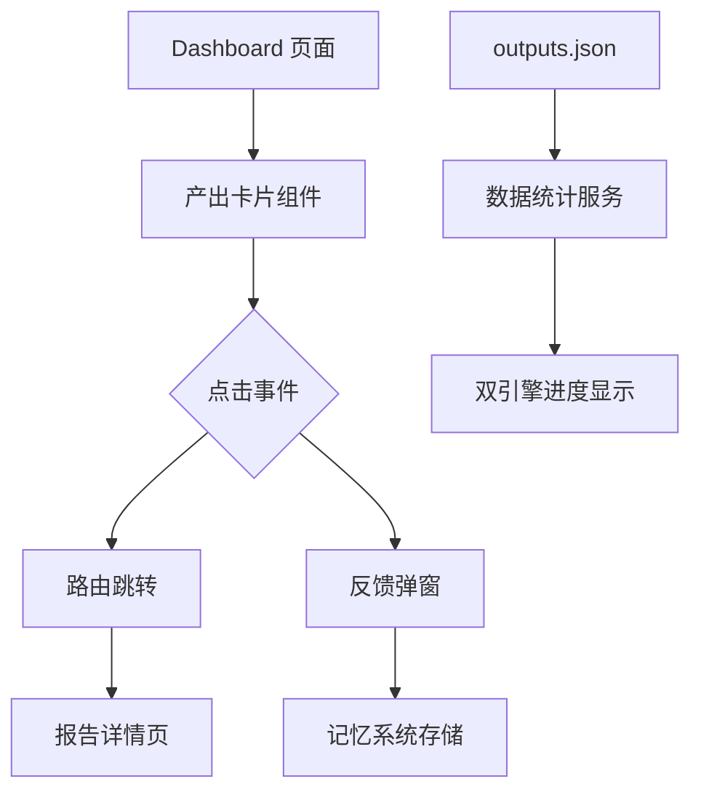

## Product Overview

修复 Iris 数字分身 Dashboard 页面的5个功能问题，确保产出内容可正常查看、路由跳转正确、数据统计准确，并新增反馈功能集成记忆系统。

## Core Features

1. **社区慈善报告路由修复** - 修复 /reports/community-charity 路由配置，使点击后能正确跳转到报告详情页而非 Dashboard
2. **AI动画报告跳转修复** - 修正 AI动画制片系统调研报告的 link 路径，确保与路由配置匹配
3. **产出内容链接修复** - 检查并补全所有产出卡片的 link 配置，确保每个产出都可点击查看
4. **反馈入口与记忆集成** - 在产出卡片添加评分+评论反馈入口，反馈数据保存到记忆系统供后续任务学习
5. **双引擎今日进度修复** - 从 outputs.json 统计今日产出数据，修复进度显示为0的问题

## Tech Stack

- 前端框架：React + TypeScript
- 样式方案：Tailwind CSS
- 数据存储：本地 JSON 文件（outputs.json、memory 系统）

## Tech Architecture

### System Architecture

基于现有项目架构进行修复，不引入新的架构模式。主要涉及路由配置层、数据层和组件层的修改。



### Module Division

- **路由配置模块**：修复 /reports/community-charity 等路由映射
- **产出卡片组件**：补全 link 配置，新增反馈入口
- **反馈组件**：评分+评论 UI，集成记忆系统 API
- **数据统计模块**：从 outputs.json 读取并统计今日产出

### Data Flow

1. 用户点击产出卡片 → 检查 link 配置 → 路由跳转到对应页面
2. 用户点击反馈入口 → 弹出评分评论框 → 提交保存到记忆系统
3. Dashboard 加载 → 读取 outputs.json → 按日期筛选统计 → 更新双引擎进度

## Implementation Details

### Core Directory Structure

仅展示需要修改的文件：

```
src/
├── app/
│   └── routes.tsx              # 修复路由配置
├── components/
│   └── dashboard/
│       ├── OutputCard.tsx      # 添加反馈入口
│       ├── FeedbackModal.tsx   # 新增反馈弹窗组件
│       └── EngineProgress.tsx  # 修复进度统计逻辑
├── data/
│   └── outputs.json            # 检查并补全 link 字段
└── services/
    ├── memoryService.ts        # 反馈数据存储
    └── outputService.ts        # 产出数据统计
```

### Key Code Structures

**反馈数据接口**：定义反馈信息的数据结构，包含评分、评论和关联的产出ID。

```typescript
interface FeedbackData {
  outputId: string;
  rating: number;      // 1-5 评分
  comment: string;     // 评论内容
  createdAt: Date;
}
```

**今日进度统计函数**：从 outputs.json 读取数据，按日期筛选统计各引擎的今日产出数量。

```typescript
function getTodayProgress(engine: 'work' | 'life'): {
  inProgress: number;
  completed: number;
}
```

### Technical Implementation Plan

1. **路由修复**

- 问题：/reports/community-charity 指向错误页面
- 方案：检查 routes.tsx，修正路由映射到正确的报告组件
- 验证：点击社区慈善报告可正常打开

2. **Link 配置补全**

- 问题：部分产出缺少 link 或 link 与路由不匹配
- 方案：遍历 outputs.json，补全缺失的 link 字段
- 验证：所有产出卡片可点击跳转

3. **反馈功能实现**

- 方案：创建 FeedbackModal 组件，集成评分和评论输入
- 存储：调用 memoryService 保存到记忆系统
- 验证：反馈提交成功并可被后续任务读取

4. **进度统计修复**

- 问题：shortTermTasks 为空导致进度为0
- 方案：改为从 outputs.json 统计今日产出
- 验证：双引擎显示正确的今日进度数据

## Agent Extensions

### SubAgent

- **code-explorer**
- Purpose：探索项目代码结构，定位路由配置文件、产出数据文件和相关组件
- Expected outcome：找到 routes.tsx、outputs.json、Dashboard 相关组件的具体位置和现有实现