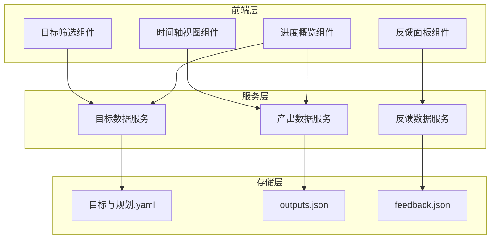

## Product Overview

为个人数字分身工作台添加目标导向的时间轴视图和反馈系统。系统从本地 memory-system 的 YAML 文件读取用户的长期目标、里程碑和当前聚焦点，以时间轴形式可视化展示数字分身围绕各目标的产出历程，并支持用户对产出进行反馈评价，反馈数据存储在本地 JSON 文件中。

## Core Features

- **目标数据读取**：从 memory-system/Intent/目标与规划.yaml 解析 long_term_goals（工作线/第二人生线）、milestones、current_focus 等结构化目标数据
- **时间轴视图**：以垂直时间轴形式展示数字分身围绕各目标的产出结果，按时间倒序排列，支持按目标分类筛选
- **产出卡片展示**：每个产出节点显示标题、关联目标、产出类型、创建时间和简要描述，点击可展开详情
- **反馈系统**：用户可对每个产出进行评分（1-5星）、添加文字评论、标记是否符合目标预期
- **本地数据持久化**：反馈数据以 JSON 格式存储在本地文件系统，支持增删改查操作
- **目标进度概览**：顶部展示各目标的完成进度和产出统计

## Tech Stack

- 前端框架：React + TypeScript
- 样式方案：Tailwind CSS
- 组件库：shadcn/ui
- 数据存储：本地 JSON 文件（通过 Node.js fs 模块读写）
- YAML 解析：js-yaml 库
- 状态管理：React Context + useReducer

## Tech Architecture

### System Architecture



### Module Division

- **目标数据模块**：负责解析 YAML 文件，提供目标、里程碑、当前聚焦点的数据访问接口
- **产出数据模块**：管理数字分身的产出记录，支持按目标、时间范围查询
- **反馈数据模块**：处理用户反馈的 CRUD 操作，维护反馈与产出的关联关系
- **时间轴展示模块**：渲染时间轴 UI，处理交互事件，支持筛选和展开详情

### Data Flow

用户访问工作台 → 加载目标数据(YAML) → 加载产出数据(JSON) → 渲染时间轴 → 用户提交反馈 → 写入反馈文件(JSON) → 更新视图

## Implementation Details

### Core Directory Structure

```
src/
├── components/
│   └── goal-timeline/
│       ├── TimelineView.tsx        # 时间轴主视图
│       ├── TimelineNode.tsx        # 时间轴节点卡片
│       ├── GoalFilter.tsx          # 目标筛选器
│       ├── FeedbackPanel.tsx       # 反馈面板
│       ├── ProgressOverview.tsx    # 进度概览
│       └── OutputDetail.tsx        # 产出详情弹窗
├── services/
│   ├── goalService.ts              # 目标数据服务
│   ├── outputService.ts            # 产出数据服务
│   └── feedbackService.ts          # 反馈数据服务
├── types/
│   └── goal-timeline.ts            # 类型定义
├── hooks/
│   └── useGoalTimeline.ts          # 时间轴状态管理
└── data/
    ├── outputs.json                # 产出数据存储
    └── feedback.json               # 反馈数据存储
```

### Key Code Structures

**Goal 数据接口**：定义从 YAML 文件解析的目标数据结构，包含长期目标分类、里程碑节点和当前聚焦点。

```typescript
interface GoalData {
  long_term_goals: {
    work_line: Goal[];
    second_life_line: Goal[];
  };
  milestones: Milestone[];
  current_focus: string[];
}

interface Goal {
  id: string;
  title: string;
  description: string;
  status: 'active' | 'completed' | 'paused';
}

interface Milestone {
  id: string;
  goalId: string;
  title: string;
  targetDate: string;
  completed: boolean;
}
```

**Output 产出接口**：记录数字分身围绕目标产生的各类产出，关联具体目标和里程碑。

```typescript
interface Output {
  id: string;
  goalId: string;
  milestoneId?: string;
  title: string;
  type: 'article' | 'code' | 'design' | 'note' | 'other';
  description: string;
  content?: string;
  createdAt: string;
  updatedAt: string;
}
```

**Feedback 反馈接口**：用户对产出的评价数据，包含评分、评论和目标符合度标记。

```typescript
interface Feedback {
  id: string;
  outputId: string;
  rating: 1 | 2 | 3 | 4 | 5;
  comment: string;
  meetsExpectation: boolean;
  createdAt: string;
}
```

### Technical Implementation Plan

**YAML 目标数据解析**

1. 问题：需要从 memory-system/Intent/目标与规划.yaml 读取结构化目标数据
2. 方案：使用 js-yaml 库解析 YAML 文件，封装为 GoalService
3. 技术：Node.js fs 模块 + js-yaml
4. 步骤：读取文件 → 解析 YAML → 转换为 TypeScript 对象 → 缓存数据
5. 验证：单元测试验证解析结果符合预期结构

**本地 JSON 存储**

1. 问题：反馈和产出数据需要持久化存储
2. 方案：使用本地 JSON 文件作为数据库，封装读写服务
3. 技术：Node.js fs 模块，JSON 序列化
4. 步骤：定义数据模型 → 实现 CRUD 接口 → 添加文件锁防止并发问题
5. 验证：测试数据的增删改查操作

## Design Style

采用现代简约风格，以清晰的时间轴为核心视觉元素。深色模式为主，配合渐变色彩突出目标分类。时间轴采用垂直布局，左侧显示时间节点，右侧展示产出卡片，卡片支持悬浮展开和点击交互。

## Page Planning

### 目标时间轴页面

- **顶部导航栏**：页面标题、目标筛选下拉菜单、时间范围选择器
- **进度概览区**：横向卡片组展示各目标的完成进度百分比和产出数量统计，使用渐变进度条
- **时间轴主体**：垂直时间轴，左侧时间刻度，右侧产出卡片，卡片包含目标标签、标题、类型图标、简述
- **反馈面板**：右侧抽屉式面板，展示选中产出的详情，包含星级评分、评论输入框、符合预期开关
- **底部状态栏**：显示当前聚焦目标和最近更新时间

## Agent Extensions

### SubAgent

- **code-explorer**
- Purpose: 分析现有项目结构和 memory-system 目录，了解 YAML 文件格式和现有代码规范
- Expected outcome: 获取目标与规划.yaml 的完整数据结构，以及项目现有的组件和服务模式