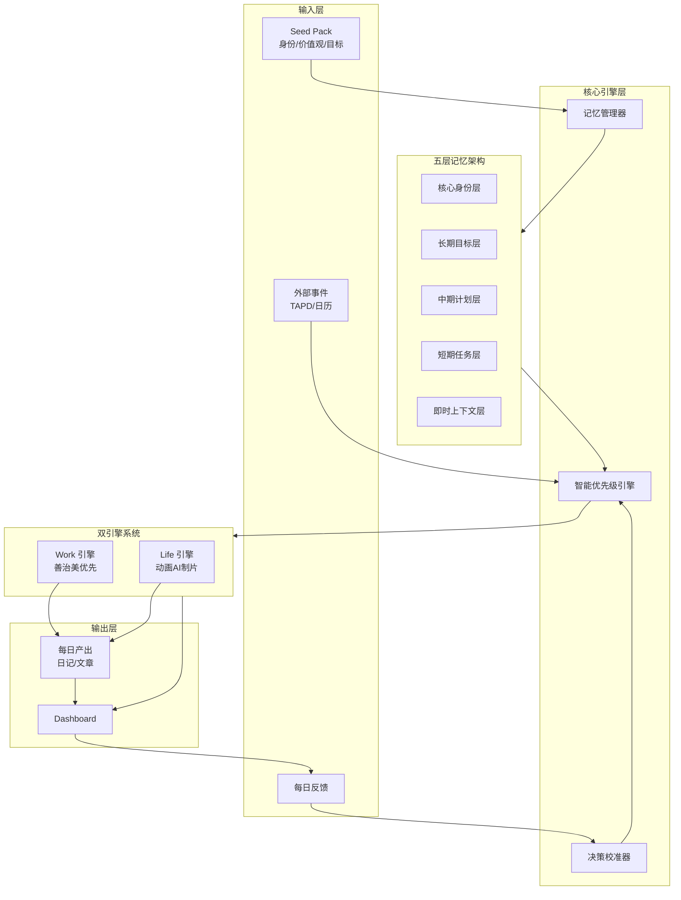

## Product Overview

Iris 数字分身复利系统是一个具备自主决策能力的个人数字孪生平台，核心创新在于「智能优先级引擎」。系统深度理解用户的身份认同、价值观体系、多条事业主线及长期目标（基于 Seed Pack），能够自主判断任务优先级并动态调整策略，而非被动执行预设任务。通过每日反馈闭环持续校准决策模型，实现长期复利价值最大化。

## Core Features

### 1. 智能优先级引擎

- 基于 Seed Pack 深度解析用户身份画像、核心价值观、多条事业主线（Work: 善治美优先 / Life: 动画 AI 制片优先）
- 自主评估任务的长期复利价值，而非短期产出导向
- 动态权重调整：Work 60% / Life 40% 可配置
- 每日反馈驱动的策略校准机制

### 2. 五层记忆架构

- 核心身份层：存储不变的身份认同与价值观
- 长期目标层：多条事业主线的战略规划
- 中期计划层：季度/月度里程碑追踪
- 短期任务层：周/日任务队列管理
- 即时上下文层：当日状态与临时信息

### 3. 双引擎任务系统

- Work 引擎：善治美项目开发、TAPD 需求处理、技术产出
- Life 引擎：动画 AI 制片系统建设、与导演刘富源的合作推进
- 引擎间智能调度与资源平衡

### 4. 可视化 Dashboard

- 任务交付状态展示与进度追踪
- 每日反馈输入界面（满意度、调整建议）
- 优先级决策透明化展示
- 复利价值累积可视化

### 5. 每日自动产出

- 复盘日记：当日决策回顾与学习总结
- 公众号文章：基于积累自动生成内容草稿
- 产出与长期目标的关联度分析

## Tech Stack

- 前端框架：React + TypeScript + Tailwind CSS
- 组件库：shadcn/ui
- 状态管理：Zustand
- 数据持久化：LocalStorage + IndexedDB（本地优先）
- AI 集成：Claude API（优先级决策、内容生成）
- 构建工具：Vite

## Tech Architecture

### System Architecture



### Module Division

**智能优先级引擎模块**

- 职责：解析 Seed Pack、评估任务复利价值、生成优先级排序
- 技术：TypeScript + Claude API
- 依赖：记忆管理模块、决策校准模块
- 接口：`evaluateTaskPriority()`, `adjustStrategy()`

**五层记忆管理模块**

- 职责：分层存储与检索用户信息、维护记忆一致性
- 技术：IndexedDB + Zustand
- 依赖：无
- 接口：`getMemoryLayer()`, `updateMemory()`, `queryContext()`

**双引擎任务模块**

- 职责：Work/Life 任务调度、进度追踪、产出管理
- 技术：TypeScript + React
- 依赖：优先级引擎、记忆管理
- 接口：`scheduleTask()`, `getEngineStatus()`, `generateOutput()`

**Dashboard 可视化模块**

- 职责：状态展示、反馈收集、决策透明化
- 技术：React + shadcn/ui + Recharts
- 依赖：任务模块、记忆模块
- 接口：`renderDashboard()`, `submitFeedback()`

### Data Flow


## Implementation Details

### Core Directory Structure

```
iris-me/
├── src/
│   ├── components/
│   │   ├── dashboard/          # Dashboard 相关组件
│   │   ├── memory/             # 记忆可视化组件
│   │   ├── task/               # 任务展示组件
│   │   └── feedback/           # 反馈输入组件
│   ├── engines/
│   │   ├── priority/           # 智能优先级引擎
│   │   ├── work/               # Work 引擎
│   │   └── life/               # Life 引擎
│   ├── memory/
│   │   ├── layers/             # 五层记忆实现
│   │   └── manager.ts          # 记忆管理器
│   ├── services/
│   │   ├── ai.ts               # AI 服务封装
│   │   └── storage.ts          # 存储服务
│   ├── stores/                 # Zustand 状态管理
│   ├── types/                  # TypeScript 类型定义
│   └── utils/                  # 工具函数
├── public/
│   └── seed-pack/              # Seed Pack 数据
└── package.json
```

### Key Code Structures

**Seed Pack 数据结构**：定义用户身份画像的核心数据模型，包含身份认同、价值观体系、事业主线和工作偏好。

```typescript
interface SeedPack {
  identity: {
    name: string;
    roles: string[];
    coreValues: string[];
  };
  businessLines: {
    work: BusinessLine[];  // 善治美等
    life: BusinessLine[];  // 动画AI制片等
  };
  preferences: {
    workLifeRatio: { work: number; life: number };
    decisionStyle: string;
  };
  collaborators: Collaborator[];  // 刘富源等
}
```

**五层记忆结构**：实现分层记忆架构，支持不同时间粒度的信息存储与检索。

```typescript
interface MemoryArchitecture {
  coreIdentity: CoreIdentityLayer;      // 不变层
  longTermGoals: GoalLayer;             // 年度战略
  midTermPlans: PlanLayer;              // 季度/月度
  shortTermTasks: TaskLayer;            // 周/日
  immediateContext: ContextLayer;       // 当日状态
}
```

**优先级评估接口**：智能优先级引擎的核心评估逻辑，综合考虑复利价值、紧急程度和资源匹配度。

```typescript
interface PriorityEngine {
  evaluateTask(task: Task, context: MemoryArchitecture): PriorityScore;
  adjustStrategy(feedback: DailyFeedback): void;
  getCompoundValue(task: Task): number;  // 复利价值评估
}
```

### Technical Implementation Plan

**智能优先级引擎实现**

1. 问题：如何基于 Seed Pack 自主判断任务优先级
2. 方案：构建多维评估模型（复利价值、紧急度、资源匹配、目标对齐度）
3. 技术：Claude API 进行语义理解 + 本地规则引擎
4. 步骤：解析 Seed Pack → 构建评估维度 → 实现打分算法 → 集成反馈校准
5. 验证：对比人工判断与系统判断的一致性

**记忆架构实现**

1. 问题：如何高效管理五层记忆的存取与同步
2. 方案：IndexedDB 持久化 + Zustand 内存缓存 + 分层查询策略
3. 技术：Dexie.js（IndexedDB 封装）+ Zustand
4. 步骤：定义层级 Schema → 实现 CRUD → 构建查询优化 → 添加同步机制
5. 验证：压力测试与数据一致性校验

## Technical Considerations

### Performance Optimization

- 记忆层采用懒加载策略，按需加载深层记忆
- AI 调用结果缓存，避免重复请求
- Dashboard 使用虚拟滚动处理大量任务列表

### Security Measures

- Seed Pack 数据本地加密存储
- AI API Key 安全管理
- 敏感信息脱敏展示

## Design Style

采用现代极简主义与数据可视化融合的设计风格，营造专业、沉稳、具有科技感的数字分身管理界面。整体以深色主题为基础，配合渐变色彩强调重要信息，体现「智能」与「复利」的产品理念。

## Page Planning

### 1. Dashboard 主控台

- **顶部导航栏**：Logo、日期时间、引擎状态指示灯（Work/Life）、设置入口
- **优先级决策面板**：当日 Top 5 任务卡片，显示复利价值评分、决策依据摘要，支持拖拽调整
- **双引擎状态区**：左右分栏展示 Work（善治美）和 Life（动画AI制片）的进度环、当前任务、产出预览
- **记忆层快览**：五层记忆的折叠式卡片，点击展开查看详情
- **每日反馈入口**：底部浮动按钮，点击展开反馈表单

### 2. Seed Pack 管理页

- **顶部导航栏**：返回按钮、页面标题、保存状态
- **身份画像区**：头像、角色标签云、核心价值观列表
- **事业主线配置**：Work/Life 双栏卡片，支持添加、编辑、排序
- **协作者管理**：合作伙伴列表（如刘富源），关联项目展示
- **偏好设置**：Work/Life 比例滑块（60%/40%）、决策风格选择

### 3. 任务详情页

- **顶部导航栏**：返回、任务标题、状态标签
- **优先级分析区**：雷达图展示多维评分（复利价值、紧急度、目标对齐度）
- **任务内容区**：描述、关联记忆、预期产出
- **执行记录**：时间线展示任务进展
- **操作按钮**：完成、延期、反馈

### 4. 每日产出页

- **顶部导航栏**：日期选择器、导出按钮
- **复盘日记区**：AI 生成的当日决策回顾，支持编辑
- **公众号文章区**：草稿预览、一键复制
- **产出统计**：本周/本月产出数量、复利累积曲线图

### 5. 反馈与校准页

- **顶部导航栏**：返回、页面标题
- **满意度评分**：五星评分 + 快速标签选择
- **调整建议**：文本输入区，支持语音输入
- **历史反馈**：时间线展示过往反馈与系统调整记录
- **提交按钮**：固定底部

## Agent Extensions

### SubAgent

- **code-explorer**
- Purpose: 探索现有项目结构，理解当前代码组织方式和技术栈配置
- Expected outcome: 获取项目目录结构、依赖配置、现有组件等信息，确保新功能与现有代码风格一致

### MCP

- **FramelinkFigmaMCP**
- Purpose: 如有 Figma 设计稿，获取设计数据用于 UI 实现参考
- Expected outcome: 提取设计规范、组件样式、布局信息

- **tapd_mcp_http**
- Purpose: 集成 TAPD 需求数据，作为 Work 引擎的任务来源
- Expected outcome: 拉取善治美项目的待办需求，自动同步到任务系统