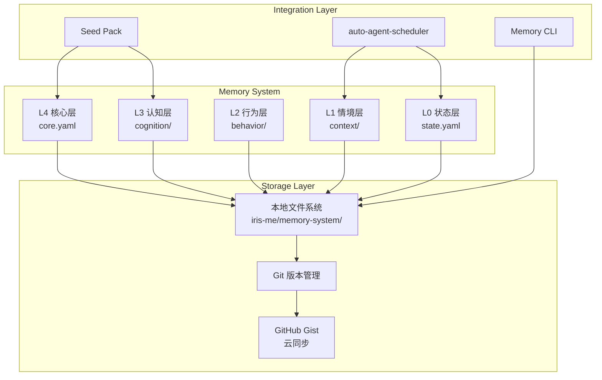
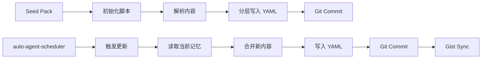

## Product Overview

基于晓辉博士的五层记忆系统理论，构建一套本地化的个人知识记忆管理系统。该系统采用 YAML 文件作为存储格式，按照 L0-L4 五个层级组织记忆内容，支持 Git 版本管理和跨设备迁移，并与 auto-agent-scheduler 集成实现复利迭代更新机制。

## Core Features

- **五层记忆架构**：实现 L0 状态层（当前状态快照）、L1 情境层（场景上下文）、L2 行为层（行为模式）、L3 认知层（知识图谱）、L4 核心层（核心价值观）的分层存储结构
- **YAML 文件存储**：在 `iris-me/memory-system/` 目录下按层级组织 YAML 文件，支持人类可读和机器解析
- **Seed Pack 初始化**：根据现有 Seed Pack 内容自动初始化各层记忆文档，建立初始知识库
- **Git 版本管理**：支持本地 Git 管理记忆变更历史，实现版本回溯和分支管理
- **GitHub Gist 云同步**：支持将记忆文件同步到 GitHub Gist，实现跨设备访问和备份
- **复利迭代更新**：集成 auto-agent-scheduler，在每次迭代反馈时自动更新相关记忆文档，实现知识的持续积累和优化

## Tech Stack

- 存储格式：YAML
- 版本管理：Git
- 云同步：GitHub Gist API
- 脚本语言：TypeScript/Node.js
- 调度集成：auto-agent-scheduler

## Tech Architecture

### System Architecture



### Module Division

- **Memory Core Module**：核心记忆管理模块，负责 YAML 文件的读写、验证和层级管理
- **Sync Module**：同步模块，处理 Git 提交和 GitHub Gist 云同步
- **Scheduler Integration Module**：调度集成模块，与 auto-agent-scheduler 对接，实现复利更新
- **CLI Module**：命令行工具，提供记忆查询、更新、同步等操作

### Data Flow



## Implementation Details

### Core Directory Structure

```
iris-me/
└── memory-system/
    ├── L0-state/
    │   └── current-state.yaml      # 当前状态快照
    ├── L1-context/
    │   ├── work-context.yaml       # 工作情境
    │   └── personal-context.yaml   # 个人情境
    ├── L2-behavior/
    │   ├── patterns.yaml           # 行为模式
    │   └── habits.yaml             # 习惯记录
    ├── L3-cognition/
    │   ├── knowledge.yaml          # 知识图谱
    │   ├── skills.yaml             # 技能清单
    │   └── insights.yaml           # 洞察积累
    ├── L4-core/
    │   ├── values.yaml             # 核心价值观
    │   ├── principles.yaml         # 行为准则
    │   └── identity.yaml           # 身份认同
    ├── scripts/
    │   ├── init-from-seedpack.ts   # Seed Pack 初始化脚本
    │   ├── sync-gist.ts            # Gist 同步脚本
    │   └── update-memory.ts        # 记忆更新脚本
    ├── schemas/
    │   └── memory-schema.yaml      # YAML Schema 定义
    └── config.yaml                 # 系统配置文件
```

### Key Code Structures

**Memory Layer Interface**：定义五层记忆的数据结构

```typescript
interface MemoryLayer {
  level: 'L0' | 'L1' | 'L2' | 'L3' | 'L4';
  name: string;
  description: string;
  lastUpdated: Date;
  content: Record<string, unknown>;
}

interface L0State {
  currentFocus: string;
  activeProjects: string[];
  mood: string;
  energy: number;
  timestamp: Date;
}

interface L4Core {
  values: string[];
  principles: string[];
  identity: {
    roles: string[];
    strengths: string[];
    aspirations: string[];
  };
}
```

**Memory Manager Class**：核心管理类

```typescript
class MemoryManager {
  async readLayer(level: string): Promise<MemoryLayer> {}
  async updateLayer(level: string, content: Partial<MemoryLayer>): Promise<void> {}
  async syncToGist(): Promise<void> {}
  async initFromSeedPack(seedPackPath: string): Promise<void> {}
}
```

### Technical Implementation Plan

1. **YAML Schema 设计**

- 定义各层级的 YAML 结构规范
- 使用 JSON Schema 进行验证
- 确保数据一致性和可扩展性

2. **Seed Pack 解析与初始化**

- 读取现有 Seed Pack 内容
- 按语义分类到对应层级
- 生成初始 YAML 文件

3. **Git 集成**

- 每次更新自动 commit
- 使用语义化 commit message
- 支持分支管理

4. **Gist 同步**

- 使用 GitHub API 创建/更新 Gist
- 支持增量同步
- 处理冲突合并

5. **Scheduler 集成**

- 定义更新触发接口
- 实现记忆合并逻辑
- 支持复利迭代模式

## Agent Extensions

### SubAgent

- **code-explorer**
- Purpose：探索现有项目结构，了解 auto-agent-scheduler 的实现方式和 Seed Pack 的内容结构
- Expected outcome：获取项目技术栈信息、现有文件结构和集成点，为记忆系统设计提供依据

### Skill

- **skill-creator**
- Purpose：为记忆系统创建专用的 Skill，封装记忆读写、同步等常用操作
- Expected outcome：生成可复用的 memory-manager skill，支持后续快速调用记忆系统功能