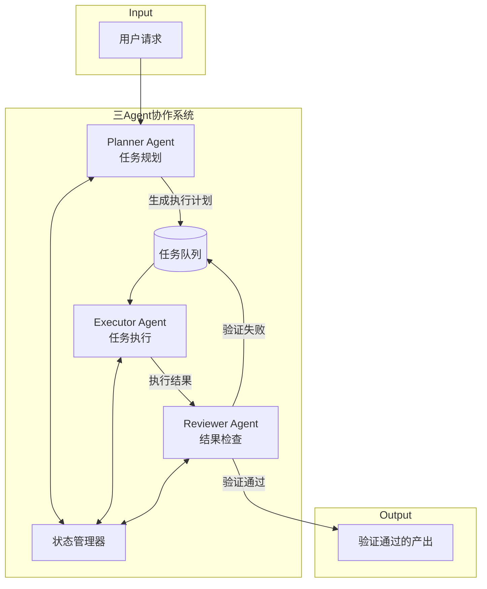
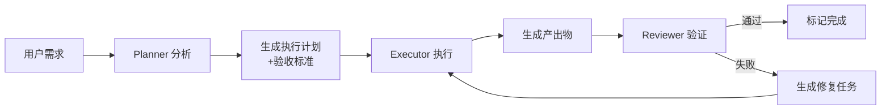

## Product Overview

设计并实现 Planner-Executor-Reviewer 三 Agent 协作系统，解决当前系统中"记录了产出但没有实际内容"的问题。通过三个专职 Agent 的协作，确保任务从规划到执行再到检查形成完整闭环，保证产出的一致性和完整性。

## Core Features

- **Planner Agent（规划者）**：负责接收用户需求，分析任务目标，生成结构化的执行计划，定义预期产出标准和验收条件
- **Executor Agent（执行者）**：按照 Planner 生成的计划逐步执行任务，生成实际内容和产出物，记录执行状态和结果
- **Reviewer Agent（检查者）**：验证 Executor 的产出是否符合 Planner 定义的标准，检查内容完整性和一致性，发现问题后触发修复流程
- **闭环协作机制**：三个 Agent 之间通过状态流转和消息传递实现协作，确保每个产出都经过验证才能标记为完成
- **问题修复流程**：当 Reviewer 发现问题时，自动生成修复任务返回给 Executor 重新执行，直到验收通过

## Tech Stack

- 开发语言：TypeScript
- 运行环境：Node.js
- 基础架构：基于现有 auto-agent-scheduler 扩展
- 状态管理：基于事件驱动的状态机

## Tech Architecture

### System Architecture

采用事件驱动的多 Agent 协作架构，三个 Agent 通过共享的任务队列和状态管理器进行通信。



### Module Division

- **Planner Module**：任务分析、计划生成、验收标准定义
- 依赖：现有 TaskGenerator
- 接口：generatePlan(), defineAcceptanceCriteria()

- **Executor Module**：任务执行、内容生成、状态上报
- 依赖：Planner 输出的执行计划
- 接口：executeTask(), reportProgress()

- **Reviewer Module**：产出验证、一致性检查、问题报告
- 依赖：现有 CodeValidator，Planner 定义的验收标准
- 接口：validateOutput(), generateFixTask()

- **Coordinator Module**：Agent 调度、状态流转、消息路由
- 接口：dispatch(), getStatus(), handleMessage()

### Data Flow



## Implementation Details

### Core Directory Structure

基于现有项目结构扩展：

```
src/
├── agents/
│   ├── planner/
│   │   ├── PlannerAgent.ts      # Planner Agent 主类
│   │   ├── PlanGenerator.ts     # 计划生成器
│   │   └── AcceptanceCriteria.ts # 验收标准定义
│   ├── executor/
│   │   ├── ExecutorAgent.ts     # Executor Agent 主类
│   │   ├── TaskRunner.ts        # 任务执行器
│   │   └── OutputGenerator.ts   # 产出生成器
│   ├── reviewer/
│   │   ├── ReviewerAgent.ts     # Reviewer Agent 主类
│   │   ├── OutputValidator.ts   # 产出验证器
│   │   └── FixTaskGenerator.ts  # 修复任务生成器
│   └── coordinator/
│       ├── AgentCoordinator.ts  # Agent 协调器
│       └── StateManager.ts      # 状态管理器
├── types/
│   └── agent-types.ts           # Agent 相关类型定义
└── utils/
    └── message-bus.ts           # 消息总线
```

### Key Code Structures

**Agent 基础接口**：定义所有 Agent 的通用行为契约。

```typescript
interface IAgent {
  name: string;
  role: 'planner' | 'executor' | 'reviewer';
  process(input: AgentInput): Promise<AgentOutput>;
  getStatus(): AgentStatus;
}
```

**执行计划结构**：Planner 生成的结构化执行计划。

```typescript
interface ExecutionPlan {
  id: string;
  tasks: TaskItem[];
  acceptanceCriteria: AcceptanceCriteria[];
  expectedOutputs: ExpectedOutput[];
}
```

**验证结果结构**：Reviewer 的验证结果。

```typescript
interface ValidationResult {
  passed: boolean;
  issues: ValidationIssue[];
  fixTasks?: TaskItem[];
}
```

### Technical Implementation Plan

**Agent 协调机制**

1. 问题：三个 Agent 需要有序协作，避免状态混乱
2. 方案：采用状态机模式管理任务生命周期
3. 技术：EventEmitter + 状态机
4. 步骤：定义状态枚举 -> 实现状态转换逻辑 -> 添加状态监听 -> 处理异常状态
5. 测试：模拟完整流程验证状态流转

**产出验证机制**

1. 问题：如何确保产出内容真实存在且完整
2. 方案：多维度验证（存在性、完整性、一致性）
3. 技术：基于现有 CodeValidator 扩展
4. 步骤：定义验证规则 -> 实现验证器 -> 集成到 Reviewer -> 生成验证报告
5. 测试：构造缺失内容场景验证检测能力

## Agent Extensions

### SubAgent

- **code-explorer**
- Purpose：分析现有 auto-agent-scheduler 项目结构，了解 TaskGenerator 和 CodeValidator 的实现细节
- Expected outcome：获取现有代码架构信息，确保新 Agent 系统与现有代码无缝集成

### MCP

- **tapd_mcp_http**
- Purpose：将开发任务同步到 TAPD 进行项目管理和进度跟踪
- Expected outcome：在 TAPD 中创建对应的开发任务，便于团队协作和进度管理