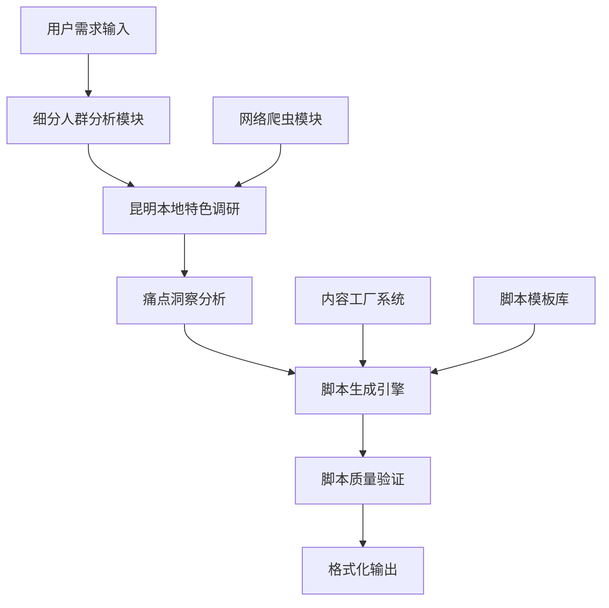

## 产品概述

昆明长租公寓细分人群视频脚本验证项目，旨在基于昆明本地特色和细分人群痛点，生成15个可直接用于视频制作的1分半脚本，验证通用内容工厂系统的实战效果。

## 核心功能

- 覆盖5个细分人群：独居女性、游戏人群、宠物友好、吸烟人群、情侣新婚
- 每个人群生成3个不同角度的视频脚本
- 脚本时长精确控制在1分半，符合短视频制作标准
- 深度洞察各细分人群的租住痛点和需求
- 结合昆明本地特色规划公寓卖点
- 脚本内容达到"可以直接拍"的制作标准

## 技术栈选择

- **数据收集与分析**: Python + Pandas + Requests
- **内容生成**: OpenAI GPT API / 本地大语言模型
- **脚本结构化**: JSON格式存储，便于后续处理
- **文档输出**: Markdown + Word格式导出

## 系统架构

## 模块划分

### 数据收集模块

- **昆明房租市场调研**: 收集昆明租房市场数据、价格区间、热门区域
- **细分人群画像分析**: 深入分析5个目标人群的生活习惯、痛点需求
- **竞品脚本分析**: 收集同类型视频脚本作为参考基准

### 脚本生成模块

- **内容工厂引擎**: 基于模板和数据生成个性化脚本内容
- **时长控制算法**: 确保脚本内容精确控制在90秒时长
- **本地化适配**: 将通用内容与昆明特色深度融合

### 质量验证模块

- **可执行性检验**: 验证脚本的拍摄可行性和制作难度
- **人群匹配度评估**: 确保内容与目标人群高度匹配
- **商业价值评估**: 评估脚本的营销转化潜力

## 数据流设计

## 核心算法

- **痛点权重算法**: 基于用户调研数据计算不同痛点的重要性权重
- **内容匹配算法**: 将公寓卖点与人群痛点进行智能匹配
- **时长预估算法**: 基于语速和内容密度精确计算脚本时长

## 推荐扩展工具

### 网络爬虫工具

- **firecrawl-web-scraper**
- 用途: 收集昆明租房市场数据、竞品分析、用户评论等关键信息
- 预期成果: 获得全面的市场数据和用户真实反馈，为脚本创作提供数据支撑

### TAPD项目管理

- **tapd_mcp_http**
- 用途: 创建项目任务管理，跟踪15个脚本的创作进度和质量验收
- 预期成果: 建立完整的项目管理流程，确保按时交付高质量脚本