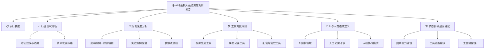

# AI 动画制片系统深度调研报告

> 📅 调研时间：2025年1月  
> 🎯 目标：为内部 AI 动画制片体系建设提供决策依据

---

## 📋 目录

1. [执行摘要](./sections/01-executive-summary.md) - 核心发现与关键建议
2. [行业现状分析](./sections/02-industry-analysis.md) - 市场规模、技术趋势、主要玩家
3. [案例深度分析](./sections/03-case-studies.md) - 成功案例、失败复盘、优缺点总结
4. [工具对比评测](./sections/04-tool-comparison.md) - 9款主流工具横向对比
5. [AI与人类边界定义](./sections/05-boundary-definition.md) - 能力边界、协作模式
6. [内部体系建设建议](./sections/06-recommendations.md) - 实施路径、资源配置
7. [参考资料](./references/sources.md) - 所有源链接汇总

---

## 🎯 报告核心价值

```
┌─────────────────────────────────────────────────────────────────┐
│                    AI 动画制片系统调研报告                        │
├─────────────────────────────────────────────────────────────────┤
│  ✅ 真实案例分析    - 网络上的 demo 和实际项目，附源链接           │
│  ✅ 工具横向对比    - Sora/可灵/Runway 等 9 款工具全面评测         │
│  ✅ 边界清晰定义    - AI 能做什么，人必须做什么                    │
│  ✅ 体系建设路径    - 从 0 到 1 搭建内部制片系统                   │
└─────────────────────────────────────────────────────────────────┘
```

---

## 📊 报告结构图



---

## 🔍 快速导航

| 章节 | 核心问题 | 阅读时间 |
|------|----------|----------|
| 执行摘要 | 这份报告的核心结论是什么？ | 5 分钟 |
| 行业现状 | AI 动画行业发展到什么程度了？ | 10 分钟 |
| 案例分析 | 别人是怎么做的？效果如何？ | 20 分钟 |
| 工具对比 | 应该选择哪些工具？ | 15 分钟 |
| 边界定义 | AI 能做什么？人必须做什么？ | 15 分钟 |
| 建设建议 | 我们应该怎么做？ | 10 分钟 |

---

## 📎 附录

- [所有源链接汇总](./references/sources.md) - 方便核验真实性和了解更多细节

---

*本报告基于 2025 年 1 月的网络公开信息整理，所有案例均附有源链接*

---

## 📈 核心数据速览

| 指标 | 数据 |
|------|------|
| 全球 AI 视频生成市场规模（2024） | **6.15 亿美元** |
| 预计 2032 年市场规模 | **超 50 亿美元** |
| 年复合增长率 | **~30%** |
| 主流工具月费范围 | **66-1400 元** |
| AI 自动完成工作量占比 | **~40%** |
| 需人工修正工作量占比 | **~35%** |
| 纯人工完成工作量占比 | **~25%** |

---

## 🏆 工具推荐速查

### 性价比首选
- **可灵 AI** - ¥66/月起，国产质量最高
- **即梦 AI** - ¥55/月起，字节系快速迭代

### 专业级选择
- **Runway Gen-3** - $15/月起，功能全面
- **Sora** - $20/月起，质量最高

### 免费入门
- **Luma Dream Machine** - 免费可用
- **Pika** - 有免费额度

---

## ⚡ 快速开始建议

1. **第一步**：注册可灵 AI + 即梦 AI（月费 ~120 元）
2. **第二步**：完成 1-2 个简单短片练习
3. **第三步**：建立角色一致性处理流程
4. **第四步**：逐步扩大生产规模

---

## 📞 报告反馈

如有问题或建议，欢迎反馈交流。
