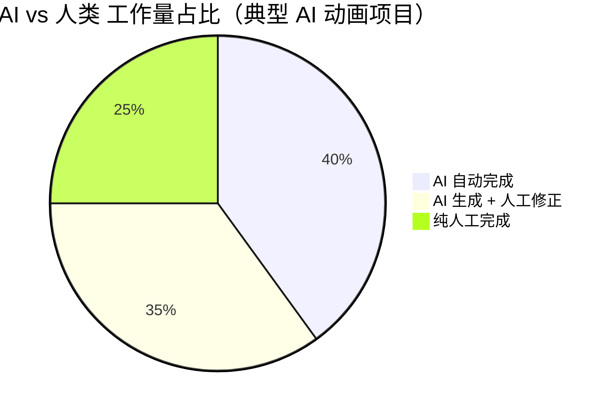

# 📋 执行摘要

> 本章节提供报告核心发现与关键建议的精炼总结

---

## 🎯 核心结论

### 1. AI 动画制作已进入"可用但需人工深度介入"阶段

```
┌─────────────────────────────────────────────────────────────────┐
│                    2025年 AI 动画能力成熟度                      │
├─────────────────────────────────────────────────────────────────┤
│  ✅ 已成熟    │ 单镜头视频生成、风格迁移、配音合成              │
│  ⚠️ 基本可用  │ 短片制作（需大量人工修正）、角色动画            │
│  ❌ 尚不成熟  │ 长片制作、复杂叙事、物理精确模拟                │
└─────────────────────────────────────────────────────────────────┘
```

### 2. 关键数据速览

| 指标 | 数据 |
|------|------|
| 全球 AI 视频生成市场规模（2024） | **6.15 亿美元** |
| 预计 2032 年市场规模 | **超 50 亿美元** |
| 单条 5 秒视频生成成本 | **4-30 元**（因工具而异） |
| 主流工具月费范围 | **66-1400 元**（可灵66元/月 至 Sora Pro 1400元/月） |
| 角色一致性问题发生率 | **约 60-80%** 需人工修正 |

### 3. AI 与人类的能力边界



**AI 擅长领域**：
- 快速生成视觉素材（图片、单镜头视频）
- 风格迁移和视觉效果
- 配音和音效生成
- 批量素材生产

**人类必须主导**：
- 剧本创作和故事逻辑
- 分镜设计和导演决策
- 角色一致性把控
- 最终质量审核和修正
- 复杂物理场景处理

---

## 🔑 关键发现

### 发现一：技术边界明确，物理模拟是硬伤

> 研究表明，AI 视频生成模型"仅能在统计上模仿物理现象，而非真正理解物理规律"。
> 
> —— 字节跳动研究院、清华大学联合研究（2024）

**典型问题**：
- 手指数量错误
- 物体运动不符合重力/惯性
- 角色在不同镜头中外观变化
- 复杂交互场景（如碰撞、流体）失真

### 发现二：商业应用已开始，但争议不断

**案例：可口可乐 2024 圣诞广告**
- 首次使用 AI 完全制作圣诞广告
- 引发大量争议："缺少灵魂"、"毫无生气"
- 公司坚持 2025 年继续使用，称"规格比去年好十倍"

**启示**：AI 动画在商业应用中需要谨慎权衡效率与品牌形象

### 发现三：工具生态快速迭代，国产工具性价比突出

| 工具 | 月费 | 性价比评价 |
|------|------|------------|
| 可灵 AI | 66 元起 | ⭐⭐⭐⭐⭐ 国产首选 |
| 即梦 AI | 55 元起 | ⭐⭐⭐⭐⭐ 字节系，迭代快 |
| Runway Gen-3 | ~105 元 | ⭐⭐⭐⭐ 功能全面 |
| Sora | 140-1400 元 | ⭐⭐⭐ 质量最高但价格昂贵 |

---

## 💡 核心建议

### 建议一：采用"人机协作"模式，而非"AI 替代"

```
推荐工作流：
人工（剧本/分镜）→ AI（素材生成）→ 人工（审核/修正）→ AI（批量优化）→ 人工（最终合成）
```

### 建议二：优先选择国产工具，降低成本门槛

- **入门推荐**：可灵 AI + 即梦 AI（月费 ~120 元）
- **进阶推荐**：可灵 + Runway（月费 ~170 元）
- **专业推荐**：可灵 + Runway + Sora（月费 ~300+ 元）

### 建议三：建立"角色一致性"专项流程

角色一致性是当前最大痛点，建议：
1. 使用三视图锁定角色形象
2. 建立角色模板库
3. 每个镜头人工审核角色一致性
4. 使用 LoRA/ControlNet 等技术辅助

### 建议四：分阶段建设内部体系

| 阶段 | 目标 | 周期 |
|------|------|------|
| 第一阶段 | 工具熟悉 + 小规模试验 | 1-2 月 |
| 第二阶段 | 建立标准工作流 | 2-3 月 |
| 第三阶段 | 规模化生产 + 持续优化 | 持续 |

---

## 📊 投资回报预估

| 场景 | 传统方式 | AI 辅助方式 | 效率提升 |
|------|----------|-------------|----------|
| 1 分钟动画短片 | 2-4 周 | 3-7 天 | **3-4 倍** |
| 10 张概念图 | 1-2 天 | 1-2 小时 | **10+ 倍** |
| 配音（1000 字） | 0.5-1 天 | 10-30 分钟 | **10+ 倍** |

**注意**：以上为素材生成效率，不包含人工审核和修正时间

---

## ⚠️ 风险提示

1. **技术迭代风险**：工具更新快，需持续学习
2. **版权风险**：AI 生成内容的版权归属尚有争议
3. **质量波动风险**：AI 输出不稳定，需预留修正时间
4. **品牌形象风险**：纯 AI 内容可能引发用户反感

---

*详细分析请阅读后续章节*
