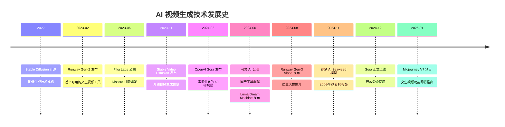
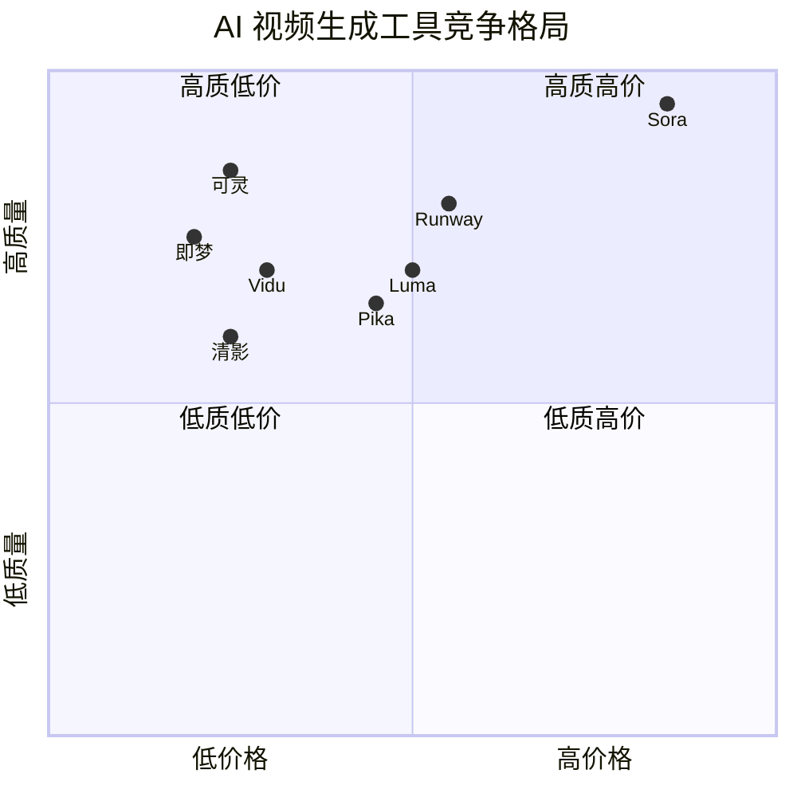

# 📈 行业现状分析

> 本章节分析 AI 动画行业的市场规模、技术发展脉络和主要玩家

---

## 📊 市场规模与趋势

### 全球 AI 视频生成市场

```
┌─────────────────────────────────────────────────────────────────┐
│                    市场规模增长趋势                              │
├─────────────────────────────────────────────────────────────────┤
│  2024年: 6.15 亿美元                                            │
│  2025年: 7.17 亿美元 (预计)                                     │
│  2032年: 50+ 亿美元 (预计)                                      │
│  年复合增长率 (CAGR): 约 30%+                                   │
└─────────────────────────────────────────────────────────────────┘
```

**数据来源**：Fortune Business Insights, 2024

### 市场增长驱动因素

| 驱动因素 | 影响程度 | 说明 |
|----------|----------|------|
| 短视频内容需求爆发 | ⭐⭐⭐⭐⭐ | 抖音、TikTok 等平台内容需求激增 |
| 创作者经济崛起 | ⭐⭐⭐⭐⭐ | 个人创作者需要低成本生产工具 |
| 广告营销数字化 | ⭐⭐⭐⭐ | 品牌需要快速产出多版本素材 |
| AI 技术突破 | ⭐⭐⭐⭐ | Diffusion + Transformer 架构成熟 |
| 算力成本下降 | ⭐⭐⭐ | 云端推理成本持续降低 |

---

## 🚀 技术发展里程碑

### AI 视频生成技术演进时间线



### 关键技术突破

| 年份 | 技术突破 | 代表产品 | 影响 |
|------|----------|----------|------|
| 2022 | Latent Diffusion | Stable Diffusion | 图像生成民主化 |
| 2023 | Video Diffusion | Runway Gen-2 | 视频生成可用化 |
| 2024 | DiT 架构 | Sora, 可灵 | 长视频、高质量 |
| 2024 | 图生视频优化 | Gen-3 Alpha | 控制性提升 |
| 2025 | 多模态融合 | 即梦 P2.0/S2.0 | 效率与质量兼顾 |

---

## 🏢 主要玩家分析

### 全球竞争格局



### 主要厂商概览

#### 国际厂商

| 厂商 | 产品 | 特点 | 优势 | 劣势 |
|------|------|------|------|------|
| **OpenAI** | Sora | 60秒长视频、电影级质量 | 质量最高、理解力强 | 价格昂贵、访问受限 |
| **Runway** | Gen-3 Alpha | 功能全面、生态完善 | 工具链完整、社区活跃 | 价格中等偏高 |
| **Pika Labs** | Pika 2.0 | 简单易用、Discord 社区 | 上手快、免费额度 | 质量一般 |
| **Luma AI** | Dream Machine | 120秒生成、免费 API | 速度快、性价比高 | 质量不稳定 |
| **Stability AI** | SVD | 开源、可本地部署 | 免费、可定制 | 需技术能力 |

#### 国内厂商

| 厂商 | 产品 | 特点 | 优势 | 劣势 |
|------|------|------|------|------|
| **快手** | 可灵 AI | 物理模拟强、中文优化 | 性价比高、质量好 | 国际化不足 |
| **字节跳动** | 即梦 AI | 迭代快、抖音生态 | 价格低、更新快 | 功能相对单一 |
| **智谱** | 清影 | 高分辨率支持 | 2K 分辨率 | 质量一般 |
| **生数科技** | Vidu | 多风格支持 | 风格多样 | 知名度低 |
| **MiniMax** | 海螺 AI | 多模态整合 | 生态完整 | 视频功能新 |

---

## 📈 行业趋势预测

### 短期趋势（2025）

1. **工具整合加速**：单一工具难以满足全流程需求，平台化趋势明显
2. **价格战持续**：国产工具持续降价，Sora 面临性价比挑战
3. **角色一致性突破**：多家厂商重点攻克角色一致性问题
4. **商业应用扩大**：广告、电商、游戏领域规模化应用

### 中期趋势（2025-2027）

1. **长视频能力成熟**：5-10 分钟连贯视频成为可能
2. **物理模拟改进**：基于物理引擎的混合方案出现
3. **实时生成**：接近实时的视频生成能力
4. **专业化分工**：针对动画、广告、影视的垂直工具

### 长期趋势（2027+）

1. **AI 导演助手**：AI 参与创意决策
2. **个性化内容工厂**：按需生成个性化视频内容
3. **虚实融合**：AI 视频与实拍无缝结合

---

## 🔗 参考链接

| 来源 | 标题 | URL |
|------|------|-----|
| Fortune Business Insights | AI Video Generator Market Report | https://www.fortunebusinessinsights.com/ai-video-generator-market-110060 |
| MIT Technology Review | AI-Generated Video Changing Film | https://www.technologyreview.com/2023/06/01/1073858/surreal-ai-generative-video-changing-film/ |
| 36氪 | AI视频新霸主诞生 Dream Machine | https://36kr.com/p/2817813456652545 |
| 知乎 | 2024年全球最火热的16款AI视频生成工具 | https://zhuanlan.zhihu.com/p/715833724 |
| 优设网 | Sora、可灵、即梦深度测评 | https://www.uisdc.com/ai-video-14 |

---

*下一章节：案例深度分析*
