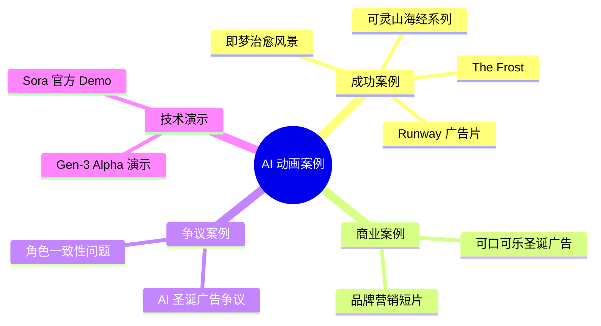
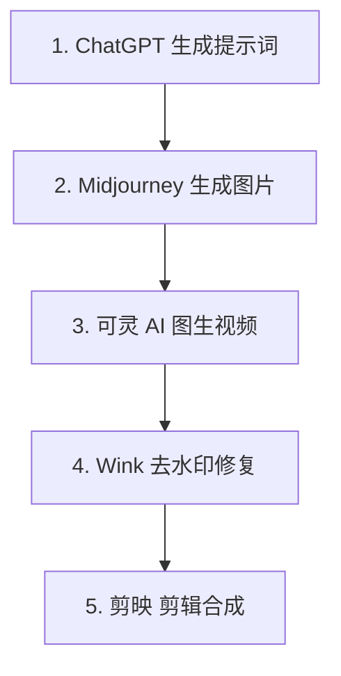

# 🎥 案例深度分析

> 本章节收集并分析网络上的 AI 动画案例和 demo，包含优缺点评估，所有案例附源链接

---

## 📌 案例总览



---

## ✅ 成功案例分析

### 案例一：《The Frost》- 全球首部 AI 生成短片

> "茫茫冰冷的山脉，军用帐篷搭建的临时营地，一群人围着火堆，狗在吠叫着..."

| 项目信息 | 详情 |
|----------|------|
| **项目名称** | The Frost（冰霜） |
| **制作团队** | Waymark / Latent Cinema |
| **发布时间** | 2023年6月 |
| **技术栈** | DALL-E 2 + Midjourney + D-ID |
| **时长** | 约 12 分钟 |

#### 制作流程


#### 优点分析

| 优点 | 说明 |
|------|------|
| ✅ 氛围营造出色 | 成功创造了神秘、不安的视觉氛围 |
| ✅ 开创性意义 | 证明了 AI 生成完整短片的可行性 |
| ✅ 成本大幅降低 | 相比传统动画制作成本降低 90%+ |
| ✅ 制作周期短 | 数周完成，传统方式需数月 |

#### 缺点分析

| 缺点 | 说明 |
|------|------|
| ❌ 角色一致性差 | 同一角色在不同镜头中外观变化明显 |
| ❌ 动作生硬 | 人物动作不自然，"恐怖谷"效应 |
| ❌ 细节失真 | 手指、面部表情等细节问题 |
| ❌ 叙事受限 | 复杂情节难以通过 AI 准确表达 |

#### 源链接

- 🔗 **MIT Technology Review 报道**: https://www.technologyreview.com/2023/06/01/1073858/surreal-ai-generative-video-changing-film/
- 🔗 **搜狐报道**: https://www.sohu.com/a/713529338_121124363

---

### 案例二：可灵 AI 山海经系列短片

> 使用可灵 AI 制作的中国神话风格动画短片

| 项目信息 | 详情 |
|----------|------|
| **项目类型** | 个人创作者作品 |
| **平台** | 抖音、B站 |
| **技术栈** | ChatGPT + Midjourney + 可灵 AI + 剪映 |
| **典型时长** | 1-3 分钟 |

#### 制作流程（5 步法）



#### 优点分析

| 优点 | 说明 |
|------|------|
| ✅ 视觉效果惊艳 | 中国风格渲染效果出色 |
| ✅ 成本极低 | 工具费用约 100 元/月 |
| ✅ 个人可完成 | 无需团队，一人即可操作 |
| ✅ 快速迭代 | 一晚上可产出多个版本 |

#### 缺点分析

| 缺点 | 说明 |
|------|------|
| ❌ 镜头单一 | 每个镜头相对独立，缺乏连贯性 |
| ❌ 角色变化 | 同一角色在不同镜头中可能变化 |
| ❌ 动作受限 | 复杂动作难以准确生成 |

#### 源链接

- 🔗 **抖音教程**: https://www.douyin.com/zhuanti/7430575113487255591
- 🔗 **CSDN 详细教程**: https://blog.csdn.net/zzz777qqq/article/details/145704916

---

### 案例三：即梦 AI 治愈风景系列

> 利用即梦 AI 制作的高点击治愈系风景视频

| 项目信息 | 详情 |
|----------|------|
| **项目类型** | 自媒体内容 |
| **平台** | 抖音 |
| **技术栈** | 慧言 AI + 可灵/即梦 + 剪映 |
| **效果** | 播放量破 10 万+ |

#### 制作流程

1. **生成唯美风景图**：使用 AI 绘图工具生成高清风景图
2. **图生视频**：上传至可灵/即梦进行视频化
3. **添加音乐**：配合治愈系背景音乐
4. **发布运营**：选择合适时间发布

#### 优点分析

| 优点 | 说明 |
|------|------|
| ✅ 制作简单 | 流程清晰，新手友好 |
| ✅ 效果稳定 | 风景类视频 AI 表现较好 |
| ✅ 变现潜力 | 适合自媒体账号运营 |

#### 源链接

- 🔗 **CSDN 教程**: https://blog.csdn.net/weixin_39326777/article/details/143356999

---

## 💼 商业案例分析

### 案例四：可口可乐 2024 AI 圣诞广告

> 全球首个完全由 AI 制作的大品牌圣诞广告

| 项目信息 | 详情 |
|----------|------|
| **品牌** | Coca-Cola（可口可乐） |
| **发布时间** | 2024年11月 |
| **技术栈** | ComfyUI + 多种 AI 工具 |
| **制作团队** | Secret Level, Silverside AI, Wild Card |

#### 广告内容

- 致敬 1995 年经典圣诞广告 "Holidays Are Coming"
- 保留经典卡车元素和背景音乐
- 所有场景、人物、动物和风景均由 AI 生成

#### 争议与反响

```
┌─────────────────────────────────────────────────────────────────┐
│                         公众反应                                 │
├─────────────────────────────────────────────────────────────────┤
│  👎 负面评价                                                     │
│  • "缺少灵魂"、"毫无生气"                                       │
│  • "既然是 AI 制作的，那就意味着里面没有爱"                      │
│  • "可口可乐亲自终结了魔法"                                      │
│  • 被狂喷 4000+ 楼                                               │
├─────────────────────────────────────────────────────────────────┤
│  👍 正面评价                                                     │
│  • 技术创新的勇敢尝试                                            │
│  • 制作效率大幅提升                                              │
│  • 2025 年继续使用，称"规格比去年好十倍"                        │
└─────────────────────────────────────────────────────────────────┘
```

#### 优点分析

| 优点 | 说明 |
|------|------|
| ✅ 成本效率 | 大幅降低广告制作成本 |
| ✅ 快速迭代 | 可快速生成多版本测试 |
| ✅ 技术探索 | 为行业提供商业化参考 |

#### 缺点分析

| 缺点 | 说明 |
|------|------|
| ❌ 品牌形象受损 | 大量用户表示反感 |
| ❌ 情感缺失 | 缺乏人类创作的温度 |
| ❌ 争议风险 | 引发关于 AI 替代人类的讨论 |

#### 启示

> **商业应用 AI 动画需要谨慎权衡效率与品牌形象**
> 
> 对于强调情感连接的品牌内容，纯 AI 制作可能适得其反

#### 源链接

- 🔗 **网易报道**: https://www.163.com/dy/article/JHLRRO3T05169V9M.html
- 🔗 **微博讨论**: https://www.weibo.com/1647560707/P0LWab5Nb
- 🔗 **抖音视频**: https://www.douyin.com/video/7438869833233534219

---

## 🔬 技术演示案例

### 案例五：Sora 官方演示

> OpenAI 发布的震惊世界的视频生成演示

| 项目信息 | 详情 |
|----------|------|
| **发布时间** | 2024年2月（预告）/ 2024年12月（正式） |
| **技术特点** | 60秒长视频、多角色、复杂场景 |
| **定价** | Plus $20/月，Pro $200/月 |

#### 技术亮点

- 支持生成长达 60 秒的连贯视频
- 多角色、特定运动类型
- 主体和背景准确细节
- 接近电影级质量

#### 局限性

- 价格昂贵（Pro 版约 1400 元/月）
- 访问受限（部分地区不可用）
- 仍存在物理规律违背问题

#### 源链接

- 🔗 **搜狐报道**: https://www.sohu.com/a/758093157_731276
- 🔗 **未来智库分析**: https://www.vzkoo.com/read/20240301f6c9c25d1e28ebfe9748d29c.html

---

### 案例六：Runway Gen-3 Alpha 演示

> Runway 最新视频生成模型演示

| 项目信息 | 详情 |
|----------|------|
| **发布时间** | 2024年6月（预告）/ 2024年8月（公测） |
| **技术特点** | 高保真度、一致性、运动表现 |
| **视频长度** | 5-10 秒 |

#### 技术亮点

- 较 Gen-2 在保真度、一致性和运动方面重大提升
- 支持图像作为视频开篇镜头
- 高写实性人类角色生成能力
- 精细化控制工具

#### 源链接

- 🔗 **3DM 游戏网报道**: https://www.3dmgame.com/news/202406/3897705.html
- 🔗 **CSDN 技术分析**: https://blog.csdn.net/shadowcz007/article/details/139816726
- 🔗 **网易报道**: https://www.163.com/dy/article/J524BCD805566ZHB.html

---

## 📊 案例对比总结

| 案例 | 类型 | 质量 | 成本 | 人工介入 | 适用场景 |
|------|------|------|------|----------|----------|
| The Frost | 艺术短片 | ⭐⭐⭐ | 低 | 高 | 实验性创作 |
| 山海经系列 | 自媒体 | ⭐⭐⭐⭐ | 极低 | 中 | 内容运营 |
| 治愈风景 | 自媒体 | ⭐⭐⭐⭐ | 极低 | 低 | 快速变现 |
| 可口可乐广告 | 商业广告 | ⭐⭐⭐ | 中 | 高 | 品牌营销（需谨慎） |
| Sora 演示 | 技术演示 | ⭐⭐⭐⭐⭐ | 高 | 低 | 高端制作 |
| Gen-3 演示 | 技术演示 | ⭐⭐⭐⭐ | 中 | 中 | 专业制作 |

---

## 💡 案例启示

### 成功要素

1. **明确定位**：清楚 AI 能做什么、不能做什么
2. **人机协作**：关键环节保留人工把控
3. **风格选择**：选择 AI 擅长的视觉风格（如风景、抽象）
4. **预期管理**：不追求完美，接受"够用"

### 失败教训

1. **过度依赖**：完全交给 AI 往往效果不佳
2. **忽视审核**：缺乏人工质量把控
3. **场景错配**：在 AI 不擅长的场景强行使用
4. **情感缺失**：忽视内容的情感价值

---

*下一章节：工具对比评测*
