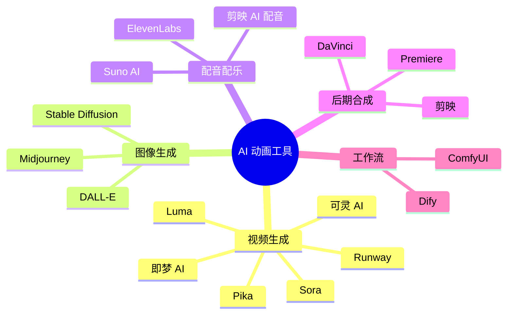

# 🛠️ 工具对比评测

> 本章节对比分析当前市场上主流的 AI 动画制作工具，包括功能、价格、适用场景等维度

---

## 📊 工具全景图



---

## 🎬 视频生成工具对比

### 核心工具横向对比

| 工具 | 厂商 | 月费 | 视频长度 | 分辨率 | 质量评分 | 性价比 |
|------|------|------|----------|--------|----------|--------|
| **Sora** | OpenAI | $20-200 | 60s | 1080p | ⭐⭐⭐⭐⭐ | ⭐⭐⭐ |
| **可灵 AI** | 快手 | ¥66-586 | 5-10s | 1080p | ⭐⭐⭐⭐⭐ | ⭐⭐⭐⭐⭐ |
| **即梦 AI** | 字节跳动 | ¥55-499 | 5-8s | 720p | ⭐⭐⭐⭐ | ⭐⭐⭐⭐⭐ |
| **Runway Gen-3** | Runway | $15-95 | 5-10s | 1080p | ⭐⭐⭐⭐ | ⭐⭐⭐⭐ |
| **Pika 2.0** | Pika Labs | $8-58 | 3-4s | 1080p | ⭐⭐⭐ | ⭐⭐⭐⭐ |
| **Luma Dream Machine** | Luma AI | 免费-$30 | 5s | 720p | ⭐⭐⭐⭐ | ⭐⭐⭐⭐⭐ |
| **Vidu** | 生数科技 | ¥29-299 | 4-8s | 1080p | ⭐⭐⭐⭐ | ⭐⭐⭐⭐ |
| **清影** | 智谱 | ¥49-499 | 6s | 2K | ⭐⭐⭐ | ⭐⭐⭐⭐ |
| **Stable Video** | Stability AI | $10起 | 4s | 720p | ⭐⭐⭐ | ⭐⭐⭐⭐ |

### 综合排名

```
┌─────────────────────────────────────────────────────────────────┐
│                    2025 AI 视频工具综合排名                      │
├─────────────────────────────────────────────────────────────────┤
│  🥇 质量排名: Sora > 可灵 > Vidu > 即梦 > Runway > Luma         │
│  🥈 价格排名: Stable Video > Vidu > 清影 > 可灵 > 即梦 > Sora   │
│  🥉 分辨率:   清影 = Sora > Vidu = 可灵 > Runway = Luma         │
│  🏅 性价比:   可灵 > 即梦 > Vidu > Luma > Runway > Sora         │
└─────────────────────────────────────────────────────────────────┘
```

---

## 🔍 重点工具详解

### 1. Sora（OpenAI）

```
┌─────────────────────────────────────────────────────────────────┐
│  Sora - 行业标杆                                                 │
├─────────────────────────────────────────────────────────────────┤
│  官网: https://sora.com (需 ChatGPT 账号)                       │
│  定价: Plus $20/月 | Pro $200/月                                │
│  特点: 60秒长视频、电影级质量、多角色支持                        │
├─────────────────────────────────────────────────────────────────┤
│  ✅ 优势                        │  ❌ 劣势                       │
│  • 质量最高                     │  • 价格昂贵                    │
│  • 长视频支持                   │  • 访问受限                    │
│  • 理解力强                     │  • 生成速度慢                  │
│  • 物理模拟较好                 │  • 与 ChatGPT 捆绑             │
├─────────────────────────────────────────────────────────────────┤
│  适用场景: 高端广告、电影预演、专业级内容创作                    │
└─────────────────────────────────────────────────────────────────┘
```

### 2. 可灵 AI（快手）

```
┌─────────────────────────────────────────────────────────────────┐
│  可灵 AI - 国产性价比之王                                        │
├─────────────────────────────────────────────────────────────────┤
│  官网: https://kling.kuaishou.com                               │
│  定价: 黄金 ¥66/月 | 铂金 ¥166/月 | 钻石 ¥586/月               │
│  特点: 物理模拟强、中文优化好、性价比高                          │
├─────────────────────────────────────────────────────────────────┤
│  ✅ 优势                        │  ❌ 劣势                       │
│  • 性价比极高                   │  • 国际化不足                  │
│  • 物理规律模拟好               │  • 视频长度受限                │
│  • 中文提示词优化               │  • 高峰期排队                  │
│  • 30fps 电影级帧率             │  • 部分风格支持弱              │
├─────────────────────────────────────────────────────────────────┤
│  适用场景: 国内内容创作、自媒体运营、商业广告                    │
└─────────────────────────────────────────────────────────────────┘
```

**可灵 AI 使用技巧**：
1. 描述清晰：包括场景、人物、动作、风格等细节
2. 使用负面关键词排除不想要的元素
3. 选择合适的运镜控制
4. 利用首尾帧功能保持连贯性

### 3. 即梦 AI（字节跳动）

```
┌─────────────────────────────────────────────────────────────────┐
│  即梦 AI - 字节系快速迭代                                        │
├─────────────────────────────────────────────────────────────────┤
│  官网: https://jimeng.jianying.com                              │
│  定价: 标准 ¥55/月 | 高级 ¥499/月 | 包年 ¥659                  │
│  特点: 迭代快、抖音生态、60秒生成5秒视频                         │
├─────────────────────────────────────────────────────────────────┤
│  ✅ 优势                        │  ❌ 劣势                       │
│  • 价格最低                     │  • 分辨率较低(720p)            │
│  • 生成速度快                   │  • 功能相对单一                │
│  • 与剪映无缝衔接               │  • 质量略逊可灵                │
│  • 更新迭代快                   │  • 长视频支持弱                │
├─────────────────────────────────────────────────────────────────┤
│  适用场景: 短视频创作、抖音运营、快速原型                        │
└─────────────────────────────────────────────────────────────────┘
```

**即梦 AI 模型版本**：
- **视频 S2.0**：Seaweed 模型，60秒内生成5秒视频
- **视频 P2.0 Pro**：PixelDance 模型，质量更高

### 4. Runway Gen-3 Alpha

```
┌─────────────────────────────────────────────────────────────────┐
│  Runway Gen-3 - 功能全面的专业工具                               │
├─────────────────────────────────────────────────────────────────┐
│  官网: https://runwayml.com                                     │
│  定价: Standard $15/月 | Pro $35/月 | Unlimited $95/月          │
│  特点: 功能全面、生态完善、社区活跃                              │
├─────────────────────────────────────────────────────────────────┤
│  ✅ 优势                        │  ❌ 劣势                       │
│  • 工具链完整                   │  • 价格中等偏高                │
│  • 图生视频优秀                 │  • 中文支持一般                │
│  • 精细控制能力                 │  • 需要科学上网                │
│  • 社区资源丰富                 │  • 学习曲线较陡                │
├─────────────────────────────────────────────────────────────────┤
│  适用场景: 专业内容创作、广告制作、影视预演                      │
└─────────────────────────────────────────────────────────────────┘
```

### 5. Pika 2.0

```
┌─────────────────────────────────────────────────────────────────┐
│  Pika - 简单易用的入门选择                                       │
├─────────────────────────────────────────────────────────────────┤
│  官网: https://pika.art                                         │
│  定价: Basic $8/月 | Standard $28/月 | Pro $58/月               │
│  特点: 简单易用、Discord 社区、上手快                            │
├─────────────────────────────────────────────────────────────────┤
│  ✅ 优势                        │  ❌ 劣势                       │
│  • 上手简单                     │  • 质量一般                    │
│  • 免费额度                     │  • 视频较短(3-4s)              │
│  • 社区活跃                     │  • 功能相对基础                │
│  • 价格亲民                     │  • 高级功能少                  │
├─────────────────────────────────────────────────────────────────┤
│  适用场景: 入门学习、快速实验、社交媒体内容                      │
└─────────────────────────────────────────────────────────────────┘
```

### 6. Luma Dream Machine

```
┌─────────────────────────────────────────────────────────────────┐
│  Luma Dream Machine - 免费高性价比                               │
├─────────────────────────────────────────────────────────────────┤
│  官网: https://lumalabs.ai/dream-machine                        │
│  定价: 免费版可用 | Pro $30/月                                  │
│  特点: 120秒生成、免费 API、速度快                               │
├─────────────────────────────────────────────────────────────────┤
│  ✅ 优势                        │  ❌ 劣势                       │
│  • 免费可用                     │  • 质量不稳定                  │
│  • 生成速度快                   │  • 分辨率较低                  │
│  • API 开放                     │  • 控制能力弱                  │
│  • 自然语言交互                 │  • 长视频支持差                │
├─────────────────────────────────────────────────────────────────┤
│  适用场景: 免费试用、快速原型、API 集成                          │
└─────────────────────────────────────────────────────────────────┘
```

---

## 🎨 辅助工具推荐

### 图像生成工具

| 工具 | 特点 | 价格 | 推荐度 |
|------|------|------|--------|
| **Midjourney** | 艺术风格强、质量高 | $10-60/月 | ⭐⭐⭐⭐⭐ |
| **Stable Diffusion** | 开源、可本地部署 | 免费 | ⭐⭐⭐⭐ |
| **DALL-E 3** | ChatGPT 集成、理解力强 | $20/月起 | ⭐⭐⭐⭐ |

### 配音配乐工具

| 工具 | 特点 | 价格 | 推荐度 |
|------|------|------|--------|
| **剪映 AI 配音** | 中文优化、免费 | 免费 | ⭐⭐⭐⭐⭐ |
| **ElevenLabs** | 音色克隆、多语言 | $5-99/月 | ⭐⭐⭐⭐ |
| **Suno AI** | AI 音乐生成 | 免费-$30/月 | ⭐⭐⭐⭐ |

### 后期合成工具

| 工具 | 特点 | 价格 | 推荐度 |
|------|------|------|--------|
| **剪映** | 免费、AI 功能丰富 | 免费 | ⭐⭐⭐⭐⭐ |
| **Premiere Pro** | 专业级、功能全面 | ¥154/月 | ⭐⭐⭐⭐ |
| **DaVinci Resolve** | 调色强、免费版可用 | 免费-$295 | ⭐⭐⭐⭐ |

---

## 💰 成本方案推荐

### 入门方案（月费 ~120 元）

```
可灵 AI 黄金会员 (¥66) + 即梦 AI 标准会员 (¥55)
= ¥121/月

适合：个人创作者、自媒体入门
```

### 进阶方案（月费 ~250 元）

```
可灵 AI 铂金会员 (¥166) + Runway Standard ($15≈¥105)
= ¥271/月

适合：专业内容创作者、小型工作室
```

### 专业方案（月费 ~500 元）

```
可灵 AI 钻石会员 (¥586) + Runway Pro ($35≈¥245)
或
可灵 AI 铂金会员 (¥166) + Sora Plus ($20≈¥140) + 即梦高级 (¥499)
= ¥500-800/月

适合：商业制作、广告公司
```

---

## 🔗 工具官方链接汇总

| 工具 | 官网 | 备注 |
|------|------|------|
| Sora | https://sora.com | 需 ChatGPT 账号 |
| 可灵 AI | https://kling.kuaishou.com | 国内直接访问 |
| 即梦 AI | https://jimeng.jianying.com | 国内直接访问 |
| Runway | https://runwayml.com | 需科学上网 |
| Pika | https://pika.art | 需科学上网 |
| Luma | https://lumalabs.ai/dream-machine | 需科学上网 |
| Midjourney | https://midjourney.com | 需科学上网 |
| Stable Diffusion | https://stability.ai | 开源可本地 |

---

*下一章节：AI 与人类边界定义*
