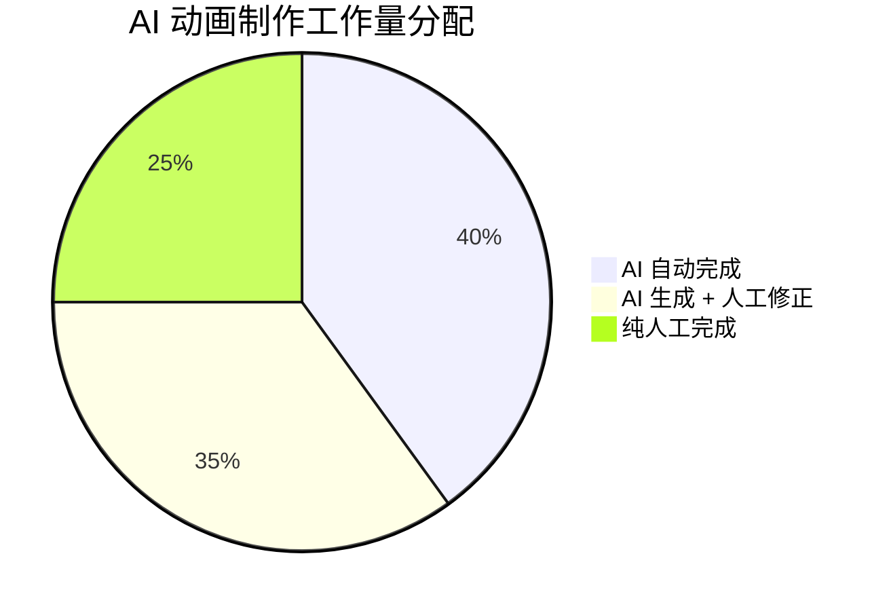
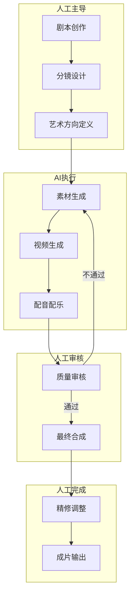

# 🎯 AI 与人类边界定义

> 本章节明确 AI 在动画制作流程中的能力边界，定义哪些环节适合 AI 处理、哪些需要人工介入

---

## 📊 边界总览



### 核心结论

> **AI 是强大的"生产力工具"，但不是"创意替代者"**
> 
> AI 擅长执行和生成，人类擅长决策和把控

---

## 🤖 AI 擅长领域（可高度自动化）

### 1. 视觉素材批量生成

| 任务 | AI 能力 | 效率提升 | 质量评估 |
|------|---------|----------|----------|
| 概念图生成 | ⭐⭐⭐⭐⭐ | 10-50 倍 | 优秀 |
| 场景渲染 | ⭐⭐⭐⭐⭐ | 10-20 倍 | 优秀 |
| 风格迁移 | ⭐⭐⭐⭐⭐ | 20-50 倍 | 优秀 |
| 单镜头视频 | ⭐⭐⭐⭐ | 5-10 倍 | 良好 |
| 背景动画 | ⭐⭐⭐⭐ | 5-10 倍 | 良好 |

**典型场景**：
- 生成多个版本的概念图供选择
- 快速产出不同风格的视觉方案
- 批量生成背景素材

### 2. 配音与音效

| 任务 | AI 能力 | 效率提升 | 质量评估 |
|------|---------|----------|----------|
| 文字转语音 | ⭐⭐⭐⭐⭐ | 50-100 倍 | 优秀 |
| 多语言配音 | ⭐⭐⭐⭐⭐ | 100+ 倍 | 良好 |
| 背景音乐生成 | ⭐⭐⭐⭐ | 10-20 倍 | 良好 |
| 音效匹配 | ⭐⭐⭐ | 5-10 倍 | 一般 |

**典型场景**：
- 快速生成多版本配音
- 多语言版本制作
- 背景音乐初稿

### 3. 简单动画效果

| 任务 | AI 能力 | 效率提升 | 质量评估 |
|------|---------|----------|----------|
| 静态图转动态 | ⭐⭐⭐⭐ | 10-20 倍 | 良好 |
| 简单运镜 | ⭐⭐⭐⭐ | 5-10 倍 | 良好 |
| 表情变化 | ⭐⭐⭐ | 3-5 倍 | 一般 |
| 口型同步 | ⭐⭐⭐ | 5-10 倍 | 一般 |

---

## 👤 人类必须主导（不可替代）

### 1. 创意与决策层

```
┌─────────────────────────────────────────────────────────────────┐
│                    人类不可替代的核心环节                         │
├─────────────────────────────────────────────────────────────────┤
│  🎬 剧本创作                                                     │
│  • 故事构思、情节设计、人物塑造                                  │
│  • AI 可辅助但不能替代创意决策                                   │
├─────────────────────────────────────────────────────────────────┤
│  🎨 艺术方向                                                     │
│  • 整体视觉风格定义                                              │
│  • 色彩、构图、氛围把控                                          │
├─────────────────────────────────────────────────────────────────┤
│  📋 分镜设计                                                     │
│  • 镜头语言、节奏把控                                            │
│  • 叙事逻辑、情感节奏                                            │
├─────────────────────────────────────────────────────────────────┤
│  ✅ 质量审核                                                     │
│  • 最终效果判断                                                  │
│  • 细节问题发现与修正                                            │
└─────────────────────────────────────────────────────────────────┘
```

### 2. 技术难点环节

| 环节 | 为什么需要人工 | AI 当前能力 |
|------|----------------|-------------|
| **角色一致性** | AI 无法保持同一角色在不同镜头中一致 | ⭐⭐ 较弱 |
| **复杂物理** | AI 不理解真实物理规律 | ⭐⭐ 较弱 |
| **精确动作** | 手指、表情等细节容易出错 | ⭐⭐ 较弱 |
| **长序列连贯** | 长视频中容易出现跳变 | ⭐⭐ 较弱 |
| **复杂交互** | 多物体/角色交互场景 | ⭐ 很弱 |

### 3. 质量把控环节

**必须人工审核的内容**：
- ✅ 角色外观是否一致
- ✅ 动作是否自然
- ✅ 物理规律是否合理
- ✅ 画面细节是否正确（手指数量、面部表情等）
- ✅ 叙事逻辑是否连贯
- ✅ 整体风格是否统一

---

## ⚠️ AI 当前技术局限

### 1. 物理规律模拟

> "AI 视频生成模型仅能在统计上模仿物理现象，而非真正理解物理规律"
> 
> —— 字节跳动研究院、清华大学联合研究

**典型问题**：

| 问题类型 | 表现 | 发生频率 |
|----------|------|----------|
| 重力异常 | 物体悬浮、下落方向错误 | 高 |
| 碰撞失真 | 物体穿透、反弹异常 | 高 |
| 流体错误 | 水、烟雾运动不自然 | 中 |
| 惯性问题 | 运动突然停止或改变 | 中 |

### 2. 角色一致性

**问题根源**：AI 模型缺乏"长期记忆"，每次生成都是独立的

**典型表现**：
- 同一角色在不同镜头中外观变化
- 服装、发型、配饰不一致
- 面部特征漂移

**当前解决方案**：
1. 使用三视图锁定角色形象
2. 建立角色模板库
3. 使用 LoRA/ControlNet 技术
4. 每个镜头人工审核

### 3. 细节准确性

**高频错误**：
- 手指数量错误（6 指、4 指）
- 面部表情不自然
- 文字/符号变形
- 对称物体不对称

### 4. 叙事连贯性

**问题**：AI 不理解"故事"，只能生成独立片段

**表现**：
- 前后镜头逻辑不连贯
- 角色行为前后矛盾
- 场景转换突兀

---

## 🔄 人机协作模式

### 推荐工作流



### 各环节分工明细

| 制作环节 | 人工职责 | AI 职责 | 协作模式 |
|----------|----------|---------|----------|
| **前期策划** | 创意构思、剧本撰写 | 辅助生成创意点子 | 人工主导 |
| **分镜设计** | 镜头规划、节奏把控 | 辅助生成分镜草图 | 人工主导 |
| **角色设计** | 风格定义、形象确认 | 批量生成候选方案 | 人工决策 |
| **场景设计** | 风格把控、氛围定义 | 批量生成场景素材 | AI 主力 |
| **动画生成** | 审核修正、一致性把控 | 批量生成动画片段 | AI 主力 |
| **配音配乐** | 情感把控、最终选择 | 生成多版本候选 | AI 主力 |
| **后期合成** | 剪辑节奏、最终调整 | 辅助特效、调色 | 人工主导 |
| **质量审核** | 全流程质量把控 | 无 | 人工完成 |

---

## 📊 能力边界矩阵

```
                    AI 能力强 ←──────────────────────→ AI 能力弱
                         │                                │
人                       │    ┌─────────────────┐        │
工                       │    │  风格迁移       │        │
介                       │    │  背景生成       │        │
入                       │    │  配音合成       │        │
少                       │    └─────────────────┘        │
│                        │                                │
│                        │    ┌─────────────────┐        │
│                        │    │  单镜头视频     │        │
│                        │    │  简单动画       │        │
│                        │    └─────────────────┘        │
│                        │                                │
↓                        │    ┌─────────────────┐        │
人                       │    │  角色动画       │        │
工                       │    │  表情变化       │        │
介                       │    └─────────────────┘        │
入                       │                                │
多                       │    ┌─────────────────┐        │
                         │    │  剧本创作       │        │
                         │    │  分镜设计       │        │
                         │    │  角色一致性     │        │
                         │    │  复杂物理       │        │
                         │    └─────────────────┘        │
```

---

## 💡 边界应用建议

### 1. 明确 AI 定位

```
✅ 正确定位：AI 是"高效执行者"
❌ 错误定位：AI 是"创意替代者"
```

### 2. 建立审核机制

**必须审核的检查点**：
- [ ] 角色一致性检查
- [ ] 物理合理性检查
- [ ] 细节准确性检查
- [ ] 叙事连贯性检查
- [ ] 整体风格统一性检查

### 3. 预留修正时间

| 项目类型 | AI 生成时间 | 人工修正时间 | 总时间 |
|----------|-------------|--------------|--------|
| 简单短片 | 20% | 30% | 50% |
| 复杂短片 | 15% | 50% | 65% |
| 商业广告 | 10% | 60% | 70% |

### 4. 选择合适场景

**AI 优先场景**：
- 风景、抽象艺术类内容
- 单一角色、简单动作
- 背景动画、氛围渲染
- 快速原型、概念验证

**人工优先场景**：
- 复杂叙事、多角色互动
- 精确动作、表情表演
- 品牌形象、高端制作
- 需要情感共鸣的内容

---

*下一章节：内部体系建设建议*
