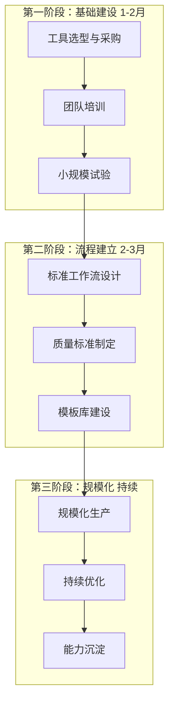
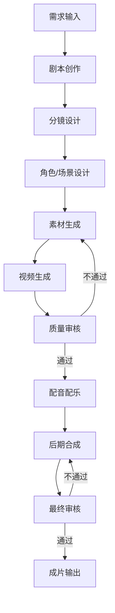
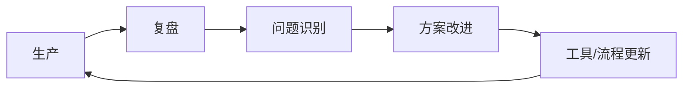
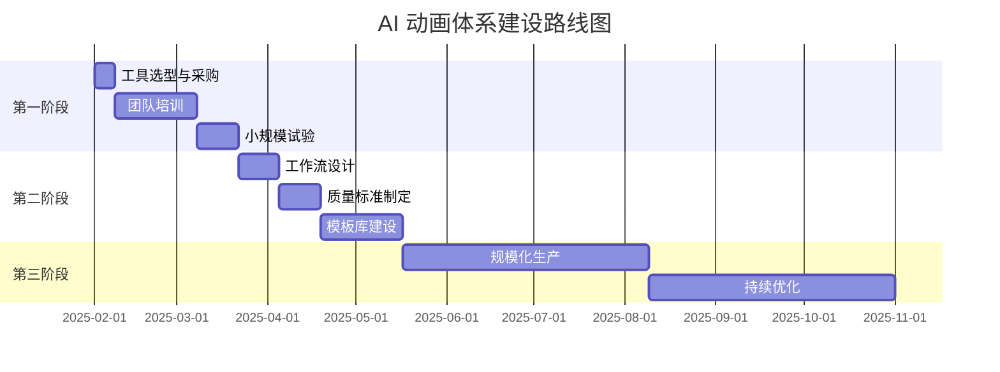

# 🏗️ 内部体系建设建议

> 本章节基于调研结果，提供内部 AI 动画制片体系的建设路径和最佳实践建议

---

## 📋 建设总览



---

## 🚀 第一阶段：基础建设（1-2 月）

### 1.1 工具选型与采购

#### 推荐工具组合

**入门配置（月费 ~200 元）**

| 工具 | 用途 | 月费 |
|------|------|------|
| 可灵 AI 黄金会员 | 视频生成 | ¥66 |
| 即梦 AI 标准会员 | 视频生成（备选） | ¥55 |
| 剪映专业版 | 后期合成 | 免费 |
| ChatGPT Plus | 剧本/提示词 | ~¥140 |
| **合计** | | **~¥261** |

**进阶配置（月费 ~500 元）**

| 工具 | 用途 | 月费 |
|------|------|------|
| 可灵 AI 铂金会员 | 视频生成（主力） | ¥166 |
| Runway Standard | 视频生成（补充） | ~¥105 |
| Midjourney Standard | 图像生成 | ~¥210 |
| 剪映专业版 | 后期合成 | 免费 |
| **合计** | | **~¥481** |

**专业配置（月费 ~1000 元）**

| 工具 | 用途 | 月费 |
|------|------|------|
| 可灵 AI 钻石会员 | 视频生成（主力） | ¥586 |
| Runway Pro | 视频生成（高端） | ~¥245 |
| Midjourney Pro | 图像生成 | ~¥420 |
| ElevenLabs | 配音 | ~¥35 |
| **合计** | | **~¥1286** |

### 1.2 团队培训

#### 培训内容大纲

```
┌─────────────────────────────────────────────────────────────────┐
│                    AI 动画制作培训体系                           │
├─────────────────────────────────────────────────────────────────┤
│  Week 1: 基础认知                                                │
│  • AI 动画技术现状与趋势                                         │
│  • 主流工具介绍与对比                                            │
│  • AI 能力边界认知                                               │
├─────────────────────────────────────────────────────────────────┤
│  Week 2: 工具实操                                                │
│  • 可灵 AI 使用教程                                              │
│  • 即梦 AI 使用教程                                              │
│  • Midjourney 提示词技巧                                         │
├─────────────────────────────────────────────────────────────────┤
│  Week 3: 工作流实践                                              │
│  • 完整短片制作流程                                              │
│  • 角色一致性处理技巧                                            │
│  • 质量审核标准                                                  │
├─────────────────────────────────────────────────────────────────┤
│  Week 4: 项目实战                                                │
│  • 小型项目实战                                                  │
│  • 问题复盘与优化                                                │
│  • 最佳实践总结                                                  │
└─────────────────────────────────────────────────────────────────┘
```

#### 关键技能清单

| 技能 | 重要性 | 学习难度 | 建议学习时间 |
|------|--------|----------|--------------|
| 提示词工程 | ⭐⭐⭐⭐⭐ | 中 | 1 周 |
| 可灵 AI 操作 | ⭐⭐⭐⭐⭐ | 低 | 2-3 天 |
| 图像生成（MJ/SD） | ⭐⭐⭐⭐ | 中 | 1 周 |
| 剪映后期 | ⭐⭐⭐⭐ | 低 | 2-3 天 |
| 角色一致性处理 | ⭐⭐⭐⭐⭐ | 高 | 2 周 |
| 质量审核 | ⭐⭐⭐⭐ | 中 | 1 周 |

### 1.3 小规模试验

#### 试验项目建议

| 项目类型 | 时长 | 难度 | 目的 |
|----------|------|------|------|
| 风景治愈短片 | 30-60s | ⭐ | 熟悉工具 |
| 单角色故事 | 1-2min | ⭐⭐ | 练习角色一致性 |
| 产品宣传片 | 30-60s | ⭐⭐ | 商业应用尝试 |
| 多角色叙事 | 2-3min | ⭐⭐⭐ | 综合能力测试 |

---

## 📐 第二阶段：流程建立（2-3 月）

### 2.1 标准工作流设计

#### 推荐工作流



#### 各环节标准

| 环节 | 负责人 | 工具 | 产出物 | 时间预估 |
|------|--------|------|--------|----------|
| 剧本创作 | 编剧/策划 | ChatGPT + 人工 | 剧本文档 | 0.5-1 天 |
| 分镜设计 | 导演/策划 | ChatGPT + 人工 | 分镜表格 | 0.5-1 天 |
| 角色设计 | 美术 | MJ/SD | 角色三视图 | 0.5 天 |
| 场景设计 | 美术 | MJ/SD | 场景素材 | 0.5 天 |
| 视频生成 | 制作 | 可灵/即梦 | 视频片段 | 1-2 天 |
| 质量审核 | 导演 | 人工 | 审核报告 | 0.5 天 |
| 配音配乐 | 音频 | 剪映/ElevenLabs | 音频素材 | 0.5 天 |
| 后期合成 | 剪辑 | 剪映/PR | 成片 | 1-2 天 |

### 2.2 质量标准制定

#### 质量检查清单

```
┌─────────────────────────────────────────────────────────────────┐
│                    AI 动画质量检查清单                           │
├─────────────────────────────────────────────────────────────────┤
│  □ 角色一致性                                                    │
│    ├─ □ 面部特征是否一致                                         │
│    ├─ □ 服装配饰是否一致                                         │
│    ├─ □ 体型比例是否一致                                         │
│    └─ □ 发型颜色是否一致                                         │
├─────────────────────────────────────────────────────────────────┤
│  □ 物理合理性                                                    │
│    ├─ □ 重力表现是否正常                                         │
│    ├─ □ 运动轨迹是否合理                                         │
│    └─ □ 物体交互是否自然                                         │
├─────────────────────────────────────────────────────────────────┤
│  □ 细节准确性                                                    │
│    ├─ □ 手指数量是否正确                                         │
│    ├─ □ 面部表情是否自然                                         │
│    ├─ □ 文字符号是否清晰                                         │
│    └─ □ 对称物体是否对称                                         │
├─────────────────────────────────────────────────────────────────┤
│  □ 叙事连贯性                                                    │
│    ├─ □ 镜头衔接是否流畅                                         │
│    ├─ □ 情节逻辑是否通顺                                         │
│    └─ □ 节奏把控是否得当                                         │
├─────────────────────────────────────────────────────────────────┤
│  □ 整体风格                                                      │
│    ├─ □ 视觉风格是否统一                                         │
│    ├─ □ 色调氛围是否一致                                         │
│    └─ □ 音画配合是否协调                                         │
└─────────────────────────────────────────────────────────────────┘
```

#### 质量等级定义

| 等级 | 标准 | 适用场景 |
|------|------|----------|
| A 级 | 无明显瑕疵，可直接商用 | 品牌广告、正式发布 |
| B 级 | 有轻微瑕疵，不影响观看 | 社交媒体、内部使用 |
| C 级 | 有明显问题，需要修正 | 草稿、概念验证 |
| D 级 | 问题严重，需要重做 | 不可使用 |

### 2.3 模板库建设

#### 模板类型

| 模板类型 | 内容 | 用途 |
|----------|------|------|
| **角色模板** | 常用角色三视图、LoRA 模型 | 保持角色一致性 |
| **场景模板** | 常用场景素材、提示词 | 快速生成场景 |
| **风格模板** | 不同风格的提示词预设 | 快速切换风格 |
| **分镜模板** | 常用分镜结构、镜头语言 | 快速设计分镜 |
| **工作流模板** | ComfyUI 工作流文件 | 批量生产 |

#### 角色模板示例

```
角色模板：科幻探险家
├── 三视图
│   ├── 正面图.png
│   ├── 侧面图.png
│   └── 背面图.png
├── 提示词
│   ├── 基础描述.txt
│   ├── 动作变体.txt
│   └── 场景适配.txt
├── LoRA 模型（可选）
│   └── explorer_v1.safetensors
└── 使用说明.md
```

---

## 📈 第三阶段：规模化生产（持续）

### 3.1 生产能力目标

| 阶段 | 月产能 | 团队规模 | 平均质量 |
|------|--------|----------|----------|
| 初期（1-3月） | 5-10 条短片 | 2-3 人 | B 级 |
| 中期（4-6月） | 15-30 条短片 | 3-5 人 | B+ 级 |
| 成熟期（6月+） | 30-50 条短片 | 5-8 人 | A 级 |

### 3.2 持续优化机制

#### 优化循环



#### 关键优化指标

| 指标 | 初期目标 | 成熟期目标 |
|------|----------|------------|
| 单片制作周期 | 5-7 天 | 2-3 天 |
| 一次通过率 | 30% | 70% |
| 返工率 | 50% | 20% |
| 人均产能 | 3 条/月 | 8 条/月 |

### 3.3 能力沉淀

#### 知识库建设

```
AI 动画知识库
├── 工具教程
│   ├── 可灵 AI 使用手册
│   ├── 即梦 AI 使用手册
│   └── Midjourney 提示词库
├── 最佳实践
│   ├── 角色一致性处理方案
│   ├── 常见问题解决方案
│   └── 质量提升技巧
├── 案例库
│   ├── 成功案例分析
│   ├── 失败案例复盘
│   └── 客户反馈汇总
└── 模板库
    ├── 角色模板
    ├── 场景模板
    └── 工作流模板
```

---

## 💰 投资回报分析

### 成本结构

| 成本项 | 月费用 | 年费用 | 备注 |
|--------|--------|--------|------|
| 工具订阅 | ¥500-1500 | ¥6000-18000 | 根据配置 |
| 人力成本 | 视团队规模 | - | 主要成本 |
| 培训成本 | ¥0-5000 | ¥0-5000 | 一次性 |
| 其他 | ¥500 | ¥6000 | 素材、服务器等 |

### 效率提升预估

| 场景 | 传统方式 | AI 辅助 | 效率提升 |
|------|----------|---------|----------|
| 1 分钟动画短片 | 2-4 周 | 3-7 天 | **3-4 倍** |
| 10 张概念图 | 1-2 天 | 1-2 小时 | **10+ 倍** |
| 配音（1000 字） | 0.5-1 天 | 10-30 分钟 | **10+ 倍** |
| 风格迁移 | 1-2 天 | 1-2 小时 | **10+ 倍** |

### ROI 预估

假设：
- 月产出 20 条短片
- 传统方式每条成本 ¥5000
- AI 辅助方式每条成本 ¥1500

```
月节省成本 = 20 × (5000 - 1500) = ¥70,000
年节省成本 = ¥840,000

工具年投入 = ¥18,000
ROI = (840,000 - 18,000) / 18,000 = 4567%
```

---

## ⚠️ 风险与应对

| 风险 | 影响 | 应对策略 |
|------|------|----------|
| 技术迭代快 | 工具/流程需频繁更新 | 保持学习，关注行业动态 |
| 质量不稳定 | 返工率高，效率下降 | 建立严格审核机制 |
| 版权争议 | 法律风险 | 关注政策，保留创作记录 |
| 人才流失 | 知识断层 | 知识库建设，文档沉淀 |
| 客户接受度 | 商业化困难 | 逐步引入，注重品质 |

---

## 📅 实施路线图



---

## 🎯 成功关键因素

1. **领导支持**：获得管理层对 AI 动画的认可和资源投入
2. **人才储备**：培养既懂动画又懂 AI 的复合型人才
3. **流程规范**：建立清晰的工作流程和质量标准
4. **持续学习**：保持对新技术、新工具的关注和学习
5. **务实预期**：正确认识 AI 能力边界，不过度依赖

---

*报告完*
